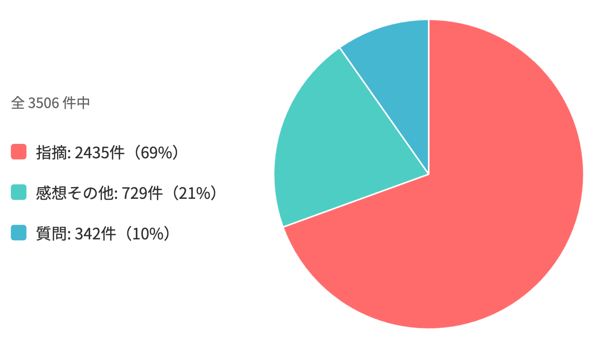
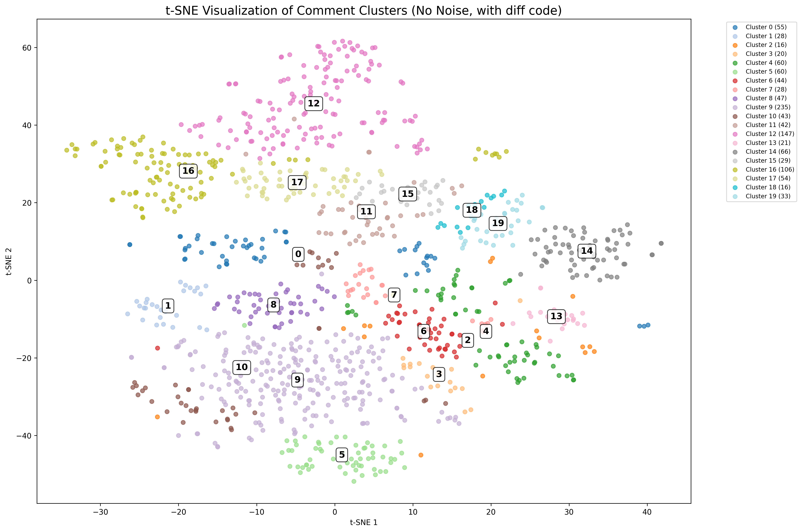
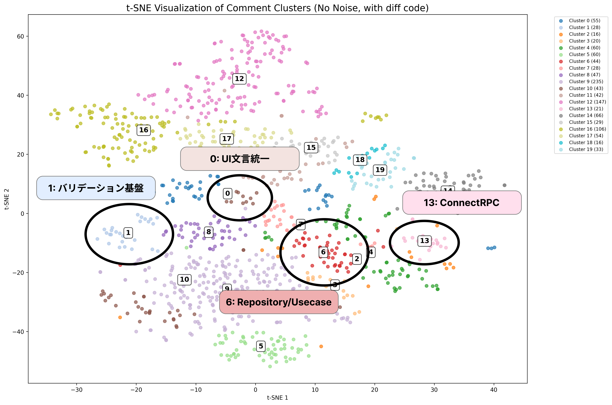
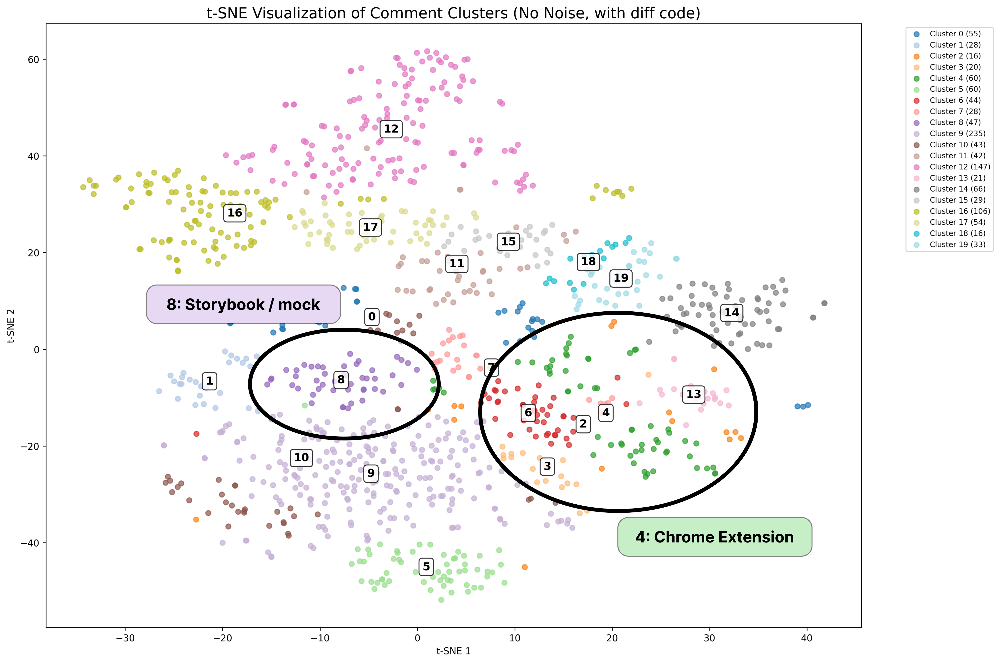
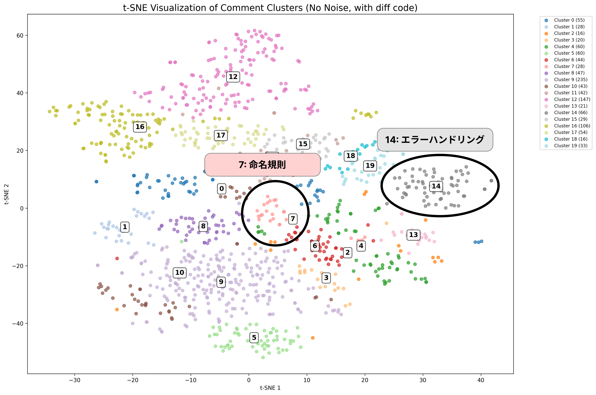
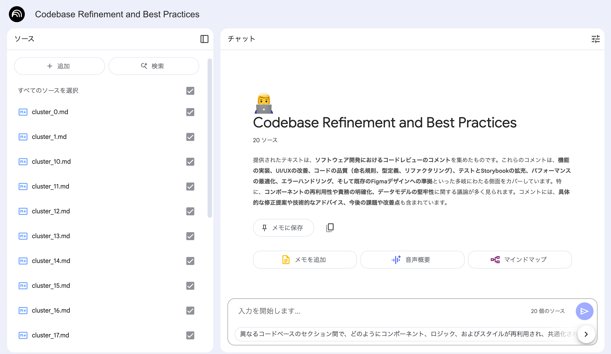
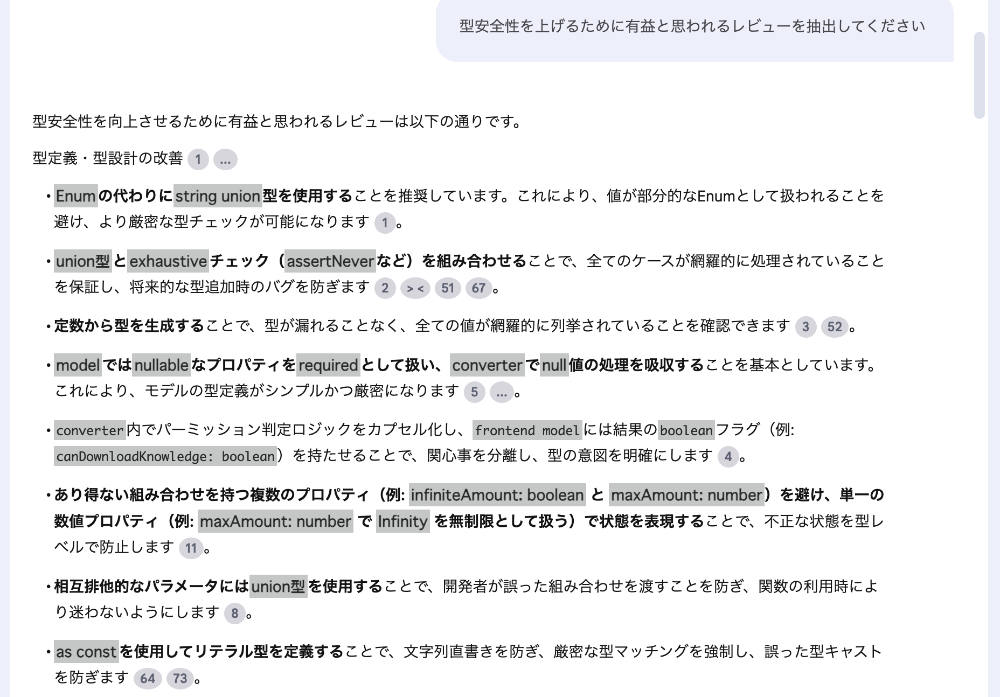

# 全コードレビューコメントを AI に分析させて<br />学びを得てみる

2025/06/13 noren.ts
@yoshiko_pg

---

## 自己紹介

&nbsp;
### よしこ [@yoshiko_pg](https://x.com/yoshiko_pg)


<small>[https://zenn.dev/yoshiko](https://zenn.dev/yoshiko)</small>

---

## 今日話すこと

- 過去のレビューをどうやって分析させたか？
- マクロな分析
- ミクロな分析
- レビューコメントから得られた学び

---

# 過去のレビューをどうやって分析させたか？

---

## 全コードレビューコメントを json で抽出

[GitHub API で取得ができます](https://docs.github.com/ja/rest/pulls/comments)

rate limit に引っかからないようにじっくり取ってくる必要があります
reviewer でフィルタができないので、取得後に絞ります

```
2020年7月から現在までの私のレビューコメント:
4798件
```

---

## 対象ファイルを絞る

json に対象ファイルパスが含まれているので `*.ts` と `*.tsx` だけに絞る

（今回のテーマが **React, TypeScript のコードレビュー** なので！）

```
結果:
4798件 → 3506 件 (73%)
```

---

## 「指摘」「質問」「感想・その他」に分類する

30 件ずつ Gemini に送り、そのコメントの種類を分類してもらいます

```
各コメントを「指摘(A)」「質問(B)」「感想・その他(C)」のいずれかに分類してください。

[ヒント]
- 「？」で終わっていても指摘の場合あり。「〜〜。どうですか？」や「〜かも？」など「？」を外したときに指摘と分類できるものは指摘に分類
- 「〜と思いました」「〜気がします」は感想ではなく指摘に分類
- 「おなじく」など他のコメントの参照は「感想・その他」に分類

[出力形式]
index ラベル 冒頭文字（改行区切り）

[出力例]
0 A e
1 B F
2 C （

[コメント本文]
{joined_comments}
```


---

## 分類結果



---

# マクロな分析

どんな種類のレビューがあったのか、ざっくり分布を見てみよう

---

## 指摘を HDBSCAN でクラスタリング

指摘コメントだけを対象に、embedding してクラスタリングしてみます
コードコメントと、対象コードの diff 数行を含めます

HDBSCAN という、クラスタ数を指定せずに自動決定されるやり方でやってみます

（全部 o3 ＆ Claude Code がやってくれました）

```
結果:
ノイズ率 53%
ノイズ除く1150件から 21クラスタが抽出できた！
```

---

## クラスタリング結果

<center>
   
</center>


---

## クラスタ分析

クラスタごとに o3 に生データを渡し
テーマとテーマの凝集度を判定させてみました

凝集度が一定以上高かったものを次に紹介します

&nbsp;

<center>
   
</center>

---

## クラスタのテーマ

<center>
   
</center>

---

## クラスタのテーマ

<center>
   
</center>

---

## クラスタのテーマ

<center>
   
</center>

---

## ざっくり大カテゴリ分類

1.	基盤整備: `#1, #6, #13, #19`
― バリデーション・リポジトリ境界・RPC クライアント・モデル必須化で土台作り

2. ユーザー体験: `#2, #4, #10, #14, #15, #17`
― 認証 UX、拡張機能、デザインシステム、エラー表示、一覧 UI など

3. 保守性向上: `#5, #9, #12, #16`
― 細部リファクタや命名統一など地味な指摘で保守性を保つ

---

# ミクロな分析

具体的にどんなレビューがあったのか、学びになりそうなものを見てみよう

---

### ひとつずつ見るの？

---



---

<center>
   
</center>

---

## すごすぎワロタ

<center>
   
</center>

---

<br />
<br />
<br />

# レビューコメントから得られた学び

### TypeScript ベスト3

<br />


---

## 第3位: 取り得る値だけを型で忠実に再現

### 相互排他的なパラメータにはunion型を使おう！

> `hogeId` と `fugaParams` 系が同時にくることはないので、
> とりうる値のunionにしたほうが使う時迷わないかなって思いました！

<div class="twoCol">

```ts
type SomeOption = {
  hogeId?: Hoge['id']
  fugaId?: Fuga['id']
  fugaName?: string
}
```

```ts
type SomeOption = {
  hogeId: Hoge['id']
} | {
  fugaId: Fuga['id']
  fugaName: string
}
```

</div>

---

## 第3位: 取り得る値だけを型で忠実に再現

### 一部の組み合わせが存在しない複数パラメータにはunion型を使おう！

> `hasAmount: false` と `infiniteAmount: true` の組み合わせはないので、
> 3種類のunionにしたらどうですか？

<div class="twoCol">

```ts
type SomeOption = {
  hasAmount: boolean
  // hasAmountがfalseの場合は必ずfalse
  infiniteAmount: boolean 
}
```

```ts
type SomeOption = {
  amount: 'NONE' | 'SPECIFIC' | 'INFINITE'
}
```

</div>

<!-- ---

## 第2位: keyの網羅性を型で担保

### 増減しうるunionに紐づく辞書的な値は型で網羅しよう！

> keyをstringではなく `Record<HogeType, Value>` にしておくと今後 `HogeType` が増えたときに型エラーで気付けそうです！

<div class="twoCol">

```ts
type HogeType = 'a' | 'b'
const valueMap = {
   'a': ...,
   'b': ...,
}
```

```ts
type HogeType = 'a' | 'b'
const valueMap: Record<HogeType, Value> = {
   'a': ...,
   'b': ...,
}
```

</div>

今後 `HogeType` に `'c'` が増えたとき、右だと型エラーになります

--- -->
---

## 第2位: as cast 撲滅

> プロパティからconst変数に入れると条件分岐での型絞り込み効くと思います！

> ここに `as const` つければいけます！

> `satisfies` で担保できます！

> 型ガード関数あるとよさそうですね！

> undefinedならthrowする `guardUndef` 関数があるので使ってくださいー！

> `Object.entries` に型つけてある `objectEntries` というhelperがあります！

> `AnimalType` に `& DogType` をつけておくことで内包が保証できてas不要になりそうです！

---

## 第1位: ありえるパターンの exhausitive チェック (native switch)

### 取り得るパターンが決まっているところは過不足を型で検出しよう！

> 以下のように、今後statusが増えたときに型エラーで気付けるようにしたいです！

<div class="twoCol">

```ts
switch (status) {
  case 'QUEUING':
    return '処理中です'
  case 'ERROR':
    return 'エラーが発生しました'
  default:
    return '' // 'SUCCESS'
}
```

```ts
switch (status) {
  case 'QUEUING':
    return '処理中です'
  case 'ERROR':
    return 'エラーが発生しました'
  case 'SUCCESS':
    return ''
  default: {
    const check: never = status
    throw new Error(`Unhandled status: ${status}`)
  }
}
```

---

## 第1位: ありえるパターンの exhausitive チェック (ts-pattern)

### 取り得るパターンが決まっているところは過不足を型で検出しよう！

> 以下のように、今後statusが増えたときに型エラーで気付けるようにしたいです！

<div class="twoCol">

```ts
switch (status) {
  case 'QUEUING':
    return '処理中です'
  case 'ERROR':
    return 'エラーが発生しました'
  default:
    return '' // 'SUCCESS'
}
```

```ts
return match(status)
  .with('QUEUING', () => '処理中です')
  .with('ERROR', () => 'エラーが発生しました')
  .with('SUCCESS', () => '')
  .exhaustive()

// エラーにしたくないなら .otherwise(fn) もある
```

</div>


---

<br />
<br />
<br />

# レビューコメントから得られた学び

### React ベスト3

<br />


---

## 第三位 不要な再レンダリングの抑制（メモ化）

### 微細なところはスルーですが、<br />custom hooksの返り値とContextのvalueはちょっと気にしてます

> Contextのvalueに直接object渡しちゃうと別参照になっちゃいます！

<div class="twoCol">

```tsx
const close = useCallback(() => ..., [...])
return (
  <ModalContext.Provider value={{ close }}>
    ...
  </ModalContext.Provider>
)
```

```tsx
// object形式で { close } を返す
const value = useMemo(() => ..., [...])
return (
  <ModalContext.Provider value={value}>
    ...
  </ModalContext.Provider>
)
```

</div>

---

## 第二位 イベント内での重い処理

### 高頻度で発生するイベント内の処理に注意！

> 連続的に起きるイベントだったら、その中で毎回getBoundingClientRectとかonChangeCurrentTimeしてて重くならないかな？

```ts
const onPointerMove = (e: React.PointerEvent<HTMLDivElement>) => {
  const { left } = e.currentTarget.getBoundingClientRect()
  onChangeCurrentTime(calcSeekTime(e.clientX - left, e.currentTarget.clientWidth))
}
```

- DOM Layout再計算がかからない値を使う
- stateの更新を間引く、もしくはCSSで表示を変えるなど

---

## 第一位 Suspense / ErrorBoundary / useTransition

> Loading範囲大きくなっちゃってるからここ `Suspense` で囲ったほうがよさそう！

> Componentわけて、子でSuspenseしてErrorBoundaryでキャッチすればこのstateいらなくなると思う！

> ここ `useTransition` 使うと全体loadingになっちゃうの避けられそう！

<br />

適切に使えるとかなりシンプルに状態を減らしつつユーザー体験も向上できます

---

# 番外編

---

## 番外編: これ消せそう！

- とにかく消せるものがないか探す
- jsxが消えてたら
  - 独自classNameがついてないか
  - 専用Componentが含まれてないか
- importが消えてたら
  - そこ以外で使われているのかどうか

同一ファイルの未使用変数/importならlintで縛れますが、ファイルまたぐときが残りがち

（knipとかで自動でできるかも）

---

# おわりに

---

## おわりに

今回の登壇のために色々なAIツールで過去のレビューを分析してみました。

NotebookLMは12万行のmarkdownも難なく扱えていてかなり強力だと思いました！

<br />
<br />

私はまだ学びの活用まで進めていないですが、次の名人さんが活用についてお話しされるとのことです！

---

