# よしこさんと実践！公開Vibe Coding

 
 
 
 
 

2025/06/26  #vibe_coding_findy
@yoshko

---

---

## Vibe Codingとは？

"Vibe Coding" とは、完全に『AIの流れ（vibe）』に身を任せ、爆発的な進化を受け入れ、コードの存在そのものを忘れてしまう開発スタイルのことだ。これはLLM（Cursor Composer + Sonnetなど）があまりにも優秀になったことで可能になった。

**→ 「人間が音声やテキストで指示を出し、AIが主体となってコードを書くコーディングスタイル」**

<blockquote class="twitter-tweet">
There&#39;s a new kind of coding I call &quot;vibe coding&quot;, where you fully give in to the vibes, embrace exponentials, and forget that the code even exists. It&#39;s possible because the LLMs (e.g. Cursor Composer w Sonnet) are getting too good. Also I just talk to Composer with SuperWhisper…
&mdash; Andrej Karpathy (@karpathy) <a href="https://twitter.com/karpathy/status/1886192184808149383?ref_src=twsrc%5Etfw">2025/02/03</a></blockquote> 

---

## AI Coding?

「AIコーディング」という言葉を目にすることも増えました

Vibe Codingもそこに含まれると思いますが、その中でも元ツイートのように

- 人がコードの存在を気にしない、書かない、理解しない
- 指示だけを出して進める
- 保守性は度外視、作りきりツールや気楽な趣味プロジェクト向き

というニュアンスが強いです

---

# 個人的 Vibe Coding のやりかた今昔

---

## 2025/03 月初

当初書いてた [個人的 Vibe Coding のやりかた](https://zenn.dev/yoshiko/articles/my-vibe-coding) の内容

- 要件定義: ChatGPT 4o
- 技術選定: ChatGPT 4o
- コードベース作成: Claude Code
- 微調整: Cursor

記事出したのは4月ですが、書いた内容を実際にやっていたのは3月頭ぐらいでした
あれから4ヶ月弱経った今は…？

---

## 2025/06 月末

こうなりました

- 要件定義: ChatGPT o3
- 技術選定: ChatGPT o3
- コードベース作成: Claude Code (CLI)
- 微調整: Claude Code (IDE / Action)

事前の情報収集はChatGPT o3、コードは全部 Claude Code で書くようになりました

Claude 4 モデルのリリースと、IDE統合が大きかった
ClaudeモデルはClaude Codeから使うのが一番性能を発揮できている気がする

---

# 本日の内容

---

## 今回作るもの

- 自分の過去の登壇資料をまとめて掲載できるWebページがほしい
- スライドを見るとき、1ページずつめくるのではなく、縦に全部並んでいてほしい
- ついでにデザインかっこよくしてポートフォリオサイトとして使いたい

 

かなりふわっとしてます

始めるときは、「解決したい課題」や「こんなことやりたいアイデア」ぐらいで大丈夫
AIと一緒に作りながら詰めていくのも醍醐味です

---

## 目次

- イントロダクション  `3分`
- 要件定義  `7分`
- コーディング公開
  - サイト作成  `20分`
  - PDFデータの加工  `15分` (1.25x)
  - 見た目の調整  `10分`

55分駆け抜けます！

---

# 要件定義　with ChatGPT

---

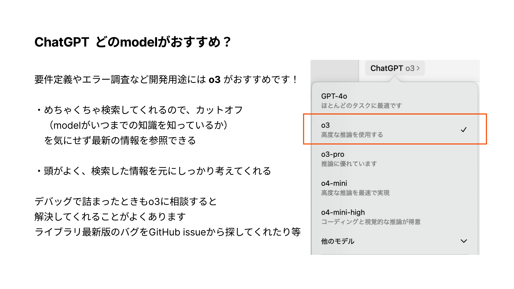

---

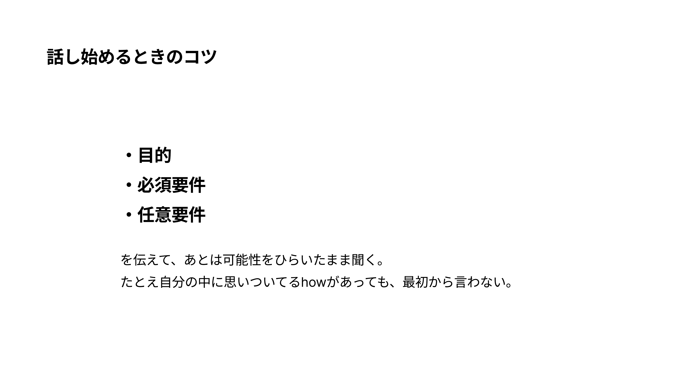

---

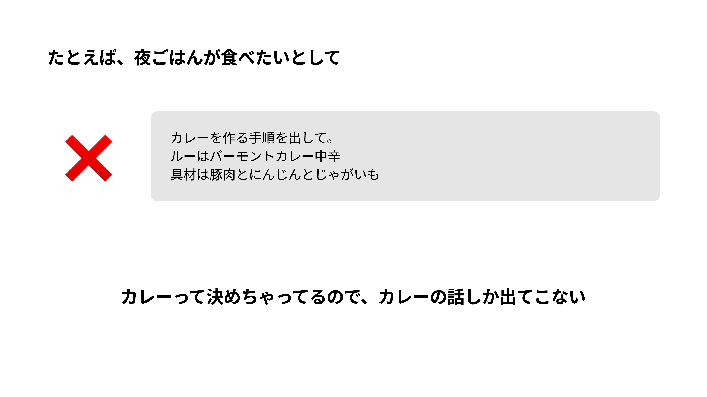

---

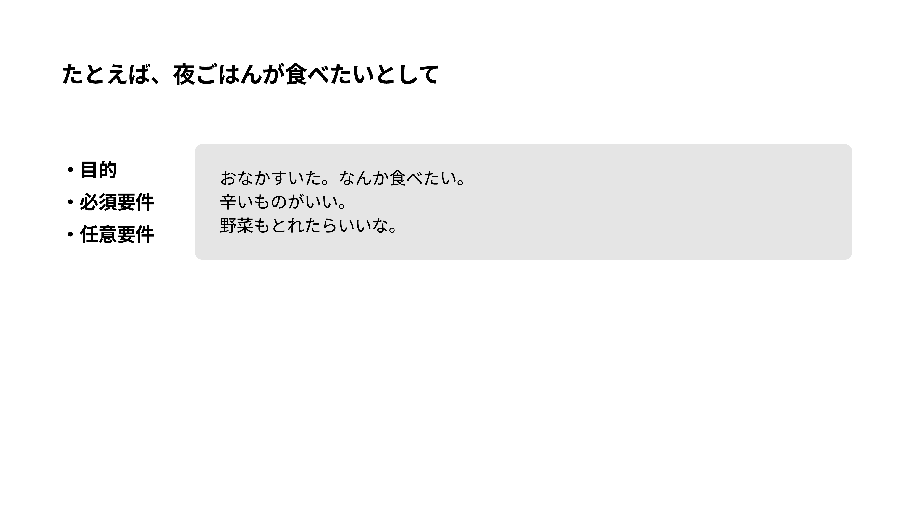

---

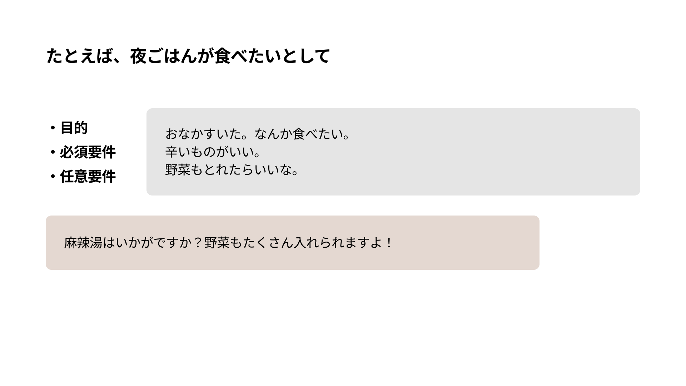

---

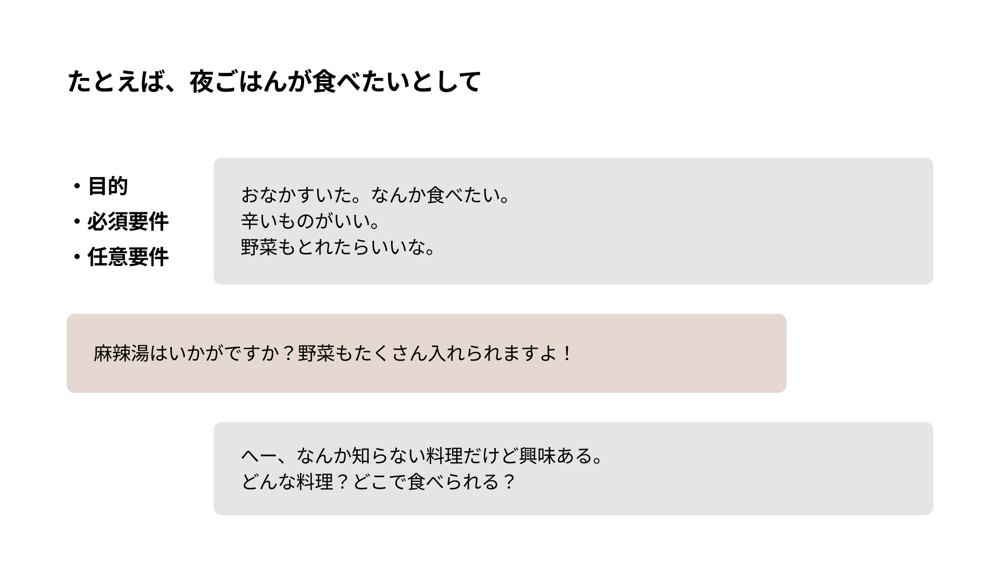

---

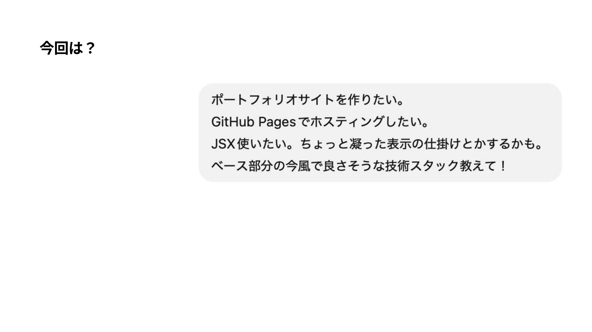

---

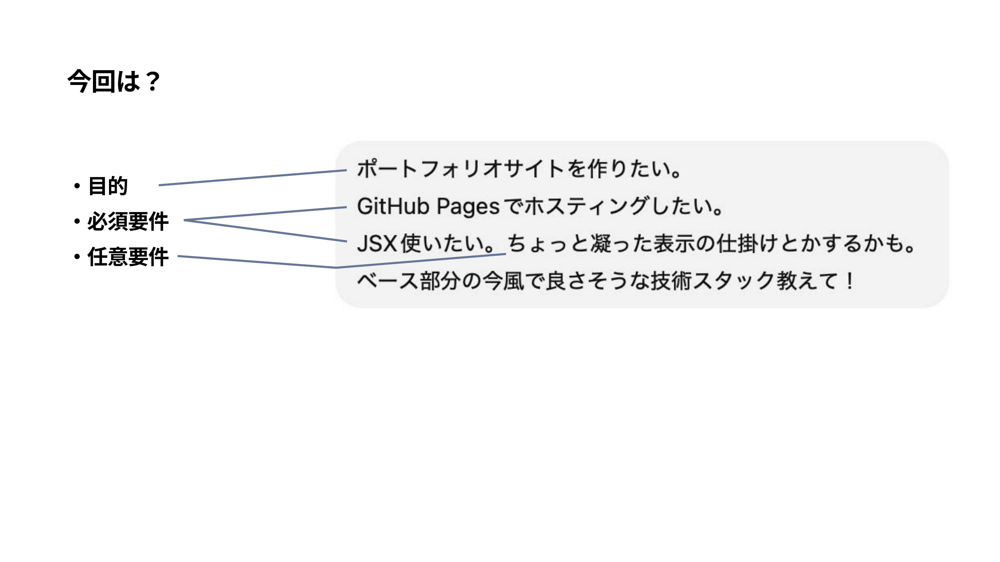

---

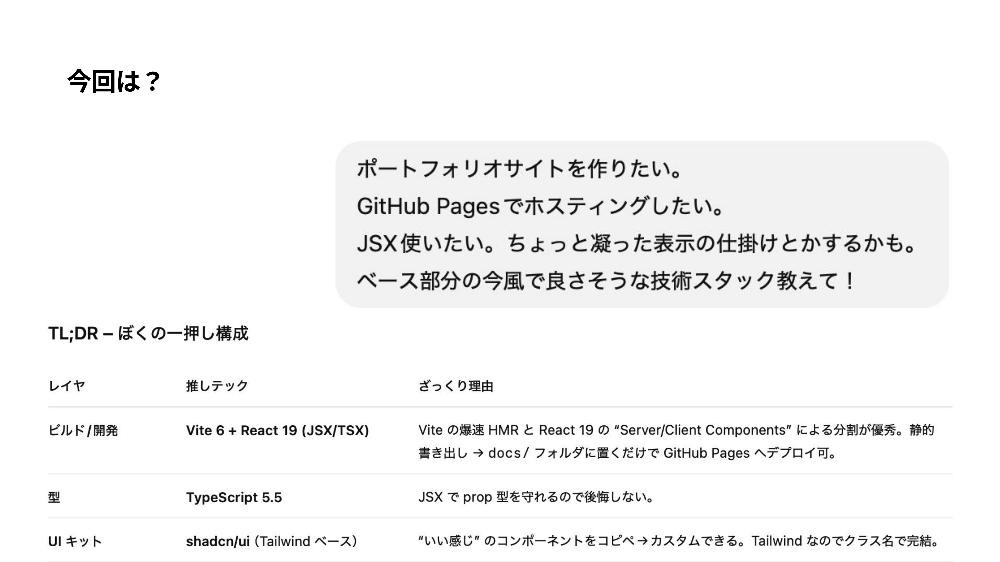

---

<video controls src="./assets/requirements.mp4" width="100%" height="100%" />

---

# Vibe Coding!　with Claude Code

----

## Vibe Coding!

- 一人で喋るのが苦手で、音声聞き取りづらいかもしれません
- 質問があれば随時Zoomチャット or Xに書いてください！
  - Zoomチャットでリアルタイムに回答返信します

---

# 1. サイト作成（20分）

---

<video controls src="./assets/coding.mp4" width="100%" height="100%" />

---

# 2. PDFデータの加工（20分を 1.3x で15分）

 
 
 
 
 

掲載する登壇資料PDFデータのタイトルがぐちゃぐちゃ
日付やイベント名をひとつひとつ書き起こすのも大変！自動でやりたい！
一覧用の表紙のサムネイルもほしい！

---

<video controls src="./assets/data.mp4" width="100%" height="100%" />

---

# 3. 見た目の調整（10分）

---

<video controls src="./assets/design.mp4" width="100%" height="100%" />

---

## デザイン調整して公開しました！　https://yoshiko-pg.github.io

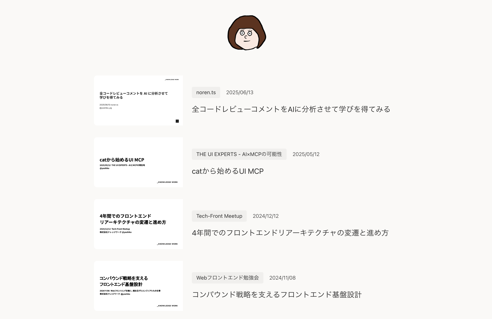

---

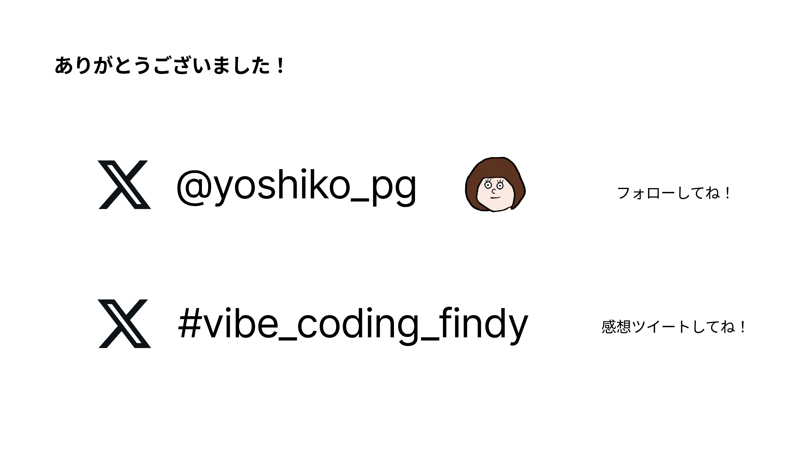