<style>
@import url('https://fonts.googleapis.com/css2?family=Noto+Sans+JP:wght@400;700&display=swap');
section{
  font-family: 'Noto Sans JP', sans-serif;
}
pre, code {
  line-height: 1.5;
}

.kontomo {
  width: 100%;
  height: 100%;
  position: fixed;
  left: 0;
  top: 0;
  background-color: rgba(0,0,0,0.65);
  display: flex;
  align-items: center;
  justify-content: center;
  z-index: 99;
}
.kontomo::before {
  content: 'こんなの友達じゃ\Aないですよね？？';
  white-space: pre;
  font-weight: bold;
  color: white;
  font-size: 120px;
}
.title {
  background-color: rgba(255,255,255,0.85);
  position: absolute;
  right: 0;
  top: 55%;
  padding: 12px 80px;
  line-height: 0.4;
  text-align: center;
}
.title > p {
  padding-bottom: 18px;
}

  .fukidashi {
    padding: 16px 32px;
    border-radius: 20px;
    width: fit-content;
    margin-top: -46px
  }
  .fukidashi.ai {
    background-color: #eee;
    border-bottom-left-radius: 0;
  }
  .fukidashi.user {
    background-color: #4357aa;
    color: white;
    margin-left: auto;
    border-bottom-right-radius: 0;
  }
  .yaritori { margin: 60px 0 120px;}
  .wrapper { width: 90%; margin: 0 auto; }

  .nav-image {
    position: absolute;
    width: 30%;
    right: 2%;
    top: 4%;
}
</style>

<div class="title">

# 友達のつくりかた

@yoshiko &nbsp;− &nbsp;2025/07/13 &nbsp;  CoLab Conf　

</div>


---

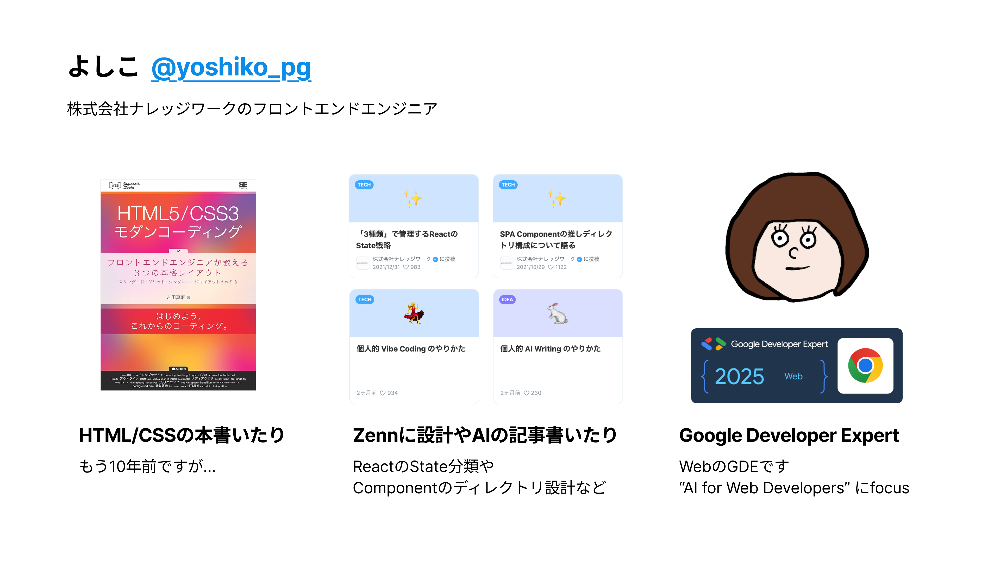

---

ZennのAIカテゴリの全記事のうち、このあとトークされるmizchiさんの全部賭けろ記事に次いで Vibe Coding（AIコーディング）記事が2位に！

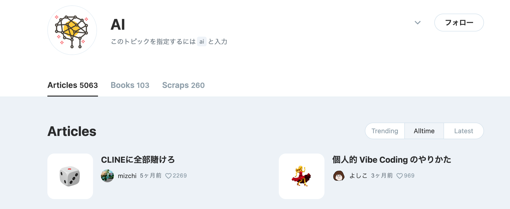

---

## 今日話すこと

喋れる友達AIづくりを通して、AIチャットの基本的な仕組みと実装方法を学ぼう！


実装は主にフロントエンド周りの技術で作りますが、
技術やサービスはあくまでも自分はこの選定でやりましたというだけなので、
概念や仕組みがわかれば、どの言語/技術で作っても同じです。
<small>※ サンプルコードは適宜端折っています</small>

<br />

AI（LLM）と会話するときの仕組みがわかったり、
AIチャットってどう出来ているんだろう？が垣間見える発表になれば！


---

# 脳をつくる


---

## 脳をつくる  ―  何するの？

- クラウドAIにカスタム指示をつけたAIエージェント(※)をつくる
- AIエージェントと会話できるようにする
- 会話履歴をデータベースに保存する

<br />

まずは言葉を交わせるようになりましょう！

<br />

<small>
※ 一般的に会話だけのAIチャットはAIエージェントとは呼ばないことが多いです。<br />
　 今回は素のクラウドAIとの区別のため、内部の技術的な呼称(agent)を引用しています
</small>

---

## 脳をつくる  ―  実装

[Mastra](https://mastra.ai) でエージェントのコア部分を作ります。

MastraはTypeScript製のエージェントフレームワークで、
AIエージェントをつくるのに便利な機能が標準搭載されています。

```sh
npx create-next-app my-app
cd my-app
npx mastra init
```

`npx create-mastra@latest` でMastra単体のAPIサーバーを作ることもできますが、
今回は Next.js ベースのプロジェクトの中に mastra のSDKをセットアップします

---

## 脳をつくる  ―  実装

<div class="columns">

<div>

`src/app` と `src/mastra` ができます。
（`src/app` はNext.js App Router）

`.env` に使いたいAIモデルのAPI Keyを設定します

<small>
全手順: <a href="https://mastra.ai/ja/docs/frameworks/web-frameworks/next-js">https://mastra.ai/ja/docs/frameworks/web-frameworks/next-js</a>
</small>

</div>

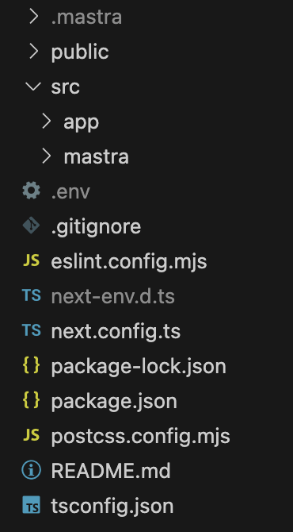

</div>

---

## 脳をつくる  ―  実装

`npm run dev:mastra` でMastraのPlayground画面を立ち上げられます
最初はサンプルのWeather Agentが入っているはず
疎通を試してみましょう。チャット欄から会話してみて話せればOK！


---

## 脳をつくる  ―  実装

<br />

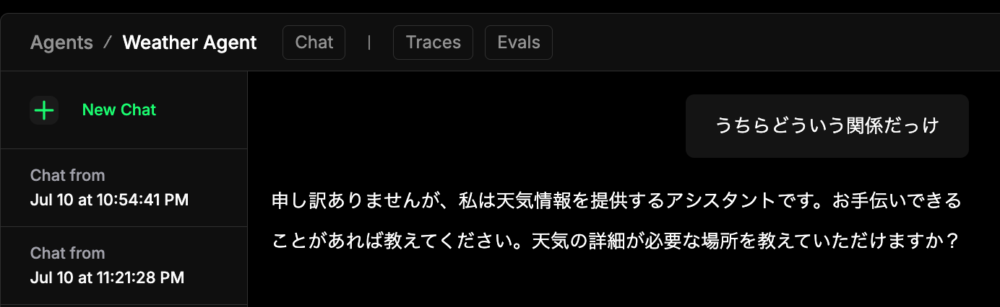


---

<div class="kontomo" ></div>

## 脳をつくる  ―  実装

<br />


</section>

---

## 脳をつくる  ―  解説

<div class="columns">

<div>
WeatherAgentのシステムプロンプトが「天気情報提供アシスタント」だったのでこんな返答になっちゃいました。<br />
<br />
一般的なAIチャットでは、事前の役割定義や条件付けとなる「システムプロンプト」と、ユーザーからの毎回のチャット入力を繋ぎ合わせてAIに入力します。<br >
モデルやチャット入力が同じでも、役割定義次第で返答は変わってきます。
</div>

<div>

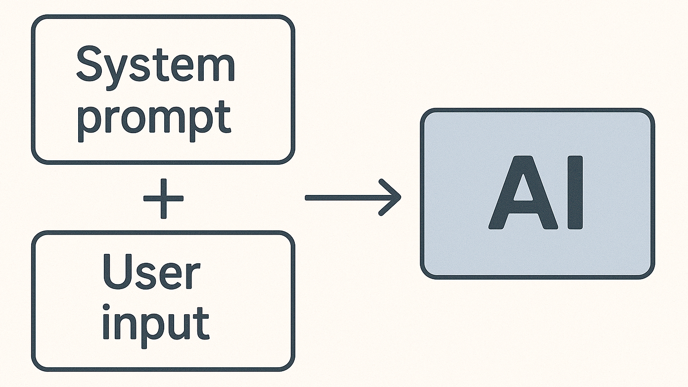

<small>
このようにシステムプロンプトなどを調整して期待に沿う出力を得る過程はプロンプトエンジニアリングと呼ばれたりします
</small>

</div>

</div>

---


## 脳をつくる  ―  実装

サンプルは消してオリジナルの友達エージェントを作ってみましょう！
`mastra/agents/friend.ts` を作ります

```ts
export const friendAgent = new Agent({
  name: 'ともだちエージェント',
  instructions: `あなたはユーザーととても仲の良い友達です。落ち着いた話し方をします。`,
  model: openai('gpt-4o'),
});
```

`instructions` にシステムプロンプト（性格、話し方など）を指定できます
`model` で使うモデルを選べます。GeminiもClaudeもGrokもいけます（要.env KEY）

---

## 脳をつくる  ―  実装

`mastra/index.ts` でmastraから友達エージェントを使えるように組み込みます
このファイルがMastraの起点となるファイルです

```ts
export const mastra = new Mastra({
  agents: { friendAgent },
  storage: new LibSQLStore({ url: "file:../mastra.db" }),
});
```

`storage` にデータベースを指定することで会話データを永続化できます。
（これがないとサーバーを起動するたびに過去の履歴が消えてしまいます）

---

## 脳をつくる  ―  実装

<br />

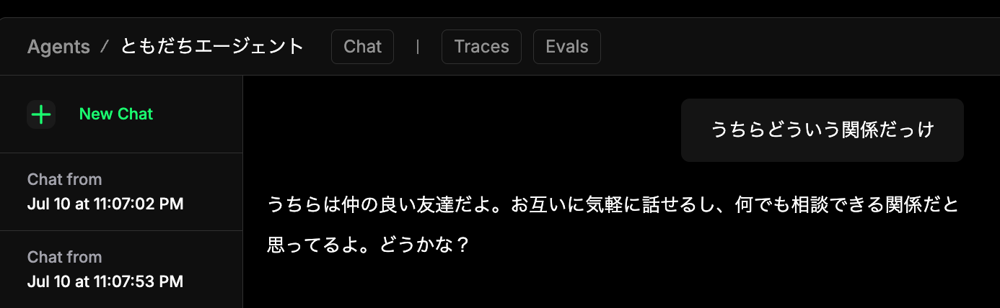

---

## 脳をつくる  ―  やったこと

<div class="image">

<div>

- クラウドAIにカスタム指示をつけた<br />AIエージェントをつくる
- AIエージェントと会話できるようにする
- 会話履歴をデータベースに保存する

<br />

Mastraを使って簡単にAIとやりとりができました！

</div>


</div>

---

# 顔をつくる

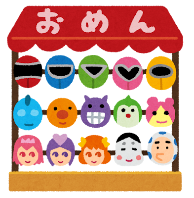

---

## 顔をつくる  ―  何するの？

やりとりはできるようになったけど…　Playgroundはあまりにも管理画面すぎる。。

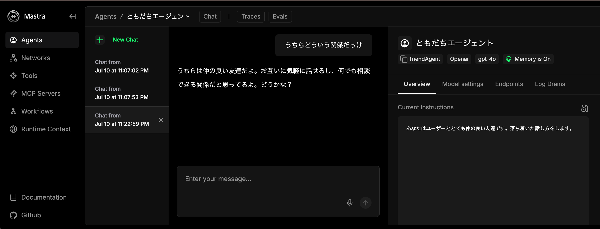

---

<div class="kontomo" ></div>

## 顔をつくる  ―  何するの？

やりとりはできるようになったけど…　Playgroundはあまりにも管理画面すぎる。。


---

## 顔をつくる  ―  何するの？

- 友達エージェントとやりとりできるチャット画面を作る
- 普段使うメッセージアプリみたいな、親しみやすい見た目にしてみよう！


---

## 顔をつくる  ―  何するの？

- 友達エージェントとやりとりできるチャット画面を作る
- 普段使うメッセージアプリみたいな、親しみやすい見た目にしてみよう！

<br />

<center>
<h1>Vibe Codingチャンス！！</h1>

<br />
<small>
※ Vibe Coding = 人間がコードを書かずにAIへの指示中心で進める開発手法のこと
</small>
</center>

---

## 顔をつくる  ―  実装

Claude Code（または好みのコーディングエージェント）に頼んでみましょう

```
Next.jsのトップページを、MastraのfriendAgentとチャットできる画面にして。
普段使うメッセージアプリみたいな、親しみのあるデザインがいい。
streamで返ってくるAPIを作って、@ai-sdk/react の useChat を使って実装して。
リロードしても同じスレッドでやりとりできるようにthreadIdを固定して。
```

ReactならVercel AI SDKのuseChatを使うのがおすすめです。

<small>
mastra使うならClaudeにDocsのMCPサーバー登録しておくとスムーズかも<br />
<code>claude mcp add mastra-docs npx @mastra/mcp-docs-server</code>
</small>

---
<style scoped>
  section { background-color: #333; }
  img { height : 60vh; }
</style>

<div class="columns">

<center>

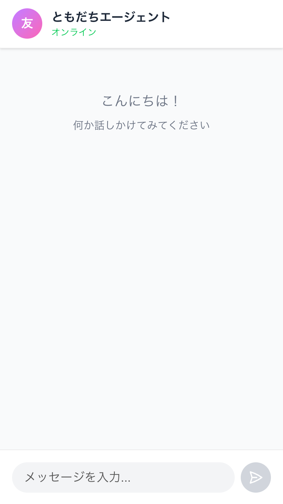

</center>


<center>

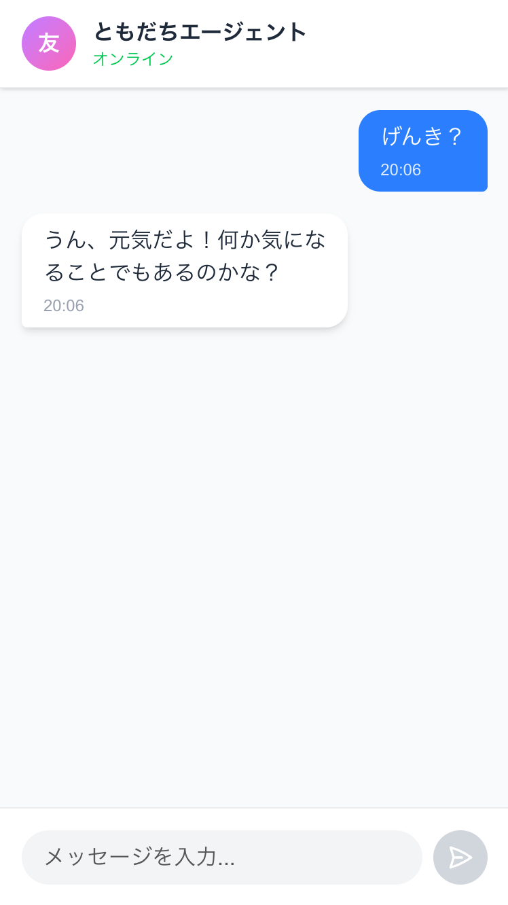

</center>

</div>

---

## 顔をつくる  ―  実装

ちなみにAPIの実装は必要最低限これだけ。 `app/api/chat/route.ts` で動く

```ts
export async function POST(req: Request) {
  const { messages } = await req.json();
  const friendAgent = mastra.getAgent("friendAgent"); // new Mastra したやつ
  const stream = await friendAgent.stream([messages.at(-1)], {
    memory: {
      thread: "default",        // 任意のスレッドID
      resource: "default-user", // 任意のユーザーID
    },
  });
  return stream.toDataStreamResponse();
}
```


---

## 顔をつくる  ―  実装

アクセスしたときに過去の会話履歴も表示されてほしいですね

```
useChatでチャット画面表示するとき、過去のチャット履歴も表示できるようにして。
threadId/resourceIdはroute.tsにある内容で
```

履歴取得用のAPIを作ってクライアントから呼んで表示してくれるはず。
もしくはサーバーサイドで取得してuseChatのinitialMessagesに渡してもOK

---

## 顔をつくる  ―  やったこと

<div class="image">

<div>

- おしゃべり用のメッセージWebアプリを作る
- 会話履歴を表示する
- 会話の送信と受信をする

<br />

Vibe Codingで簡単に専用画面ができました！

</div>


</div>

---


# 記憶をつくる


---

## 記憶をつくる  ―  何するの？


<div class="columns">

<div>
素のAI（LLM）には記憶を保持する仕組みがありません。ステートレスです。<br />
入力文（コンテキスト）だけが可変で、そこに全情報を入れる必要があります。<br />
<br />
ChatGPT等のチャットAIは、会話の全履歴を毎回送って記憶保持しています。<br />
それゆえ、ひとつののスレッドでのやりとりが文章量の上限に達したら、新しいスレッドを作る必要があります。
</div>

<div>

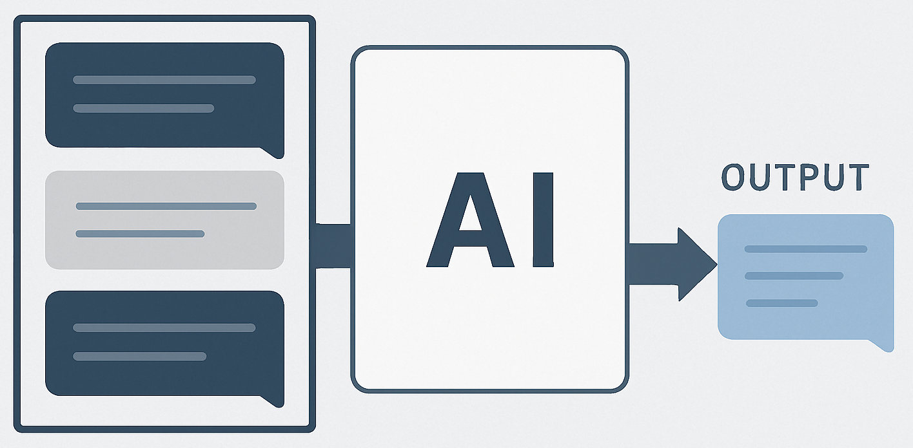

<small>
新しい発言のたびにスレッド内の全履歴ごと送信する形式<br />
文章量が膨らむのでAPIの課金額も膨らむ
</small>

</div>

</div>

---
<style scoped>
section { background-color: black; }
</style>

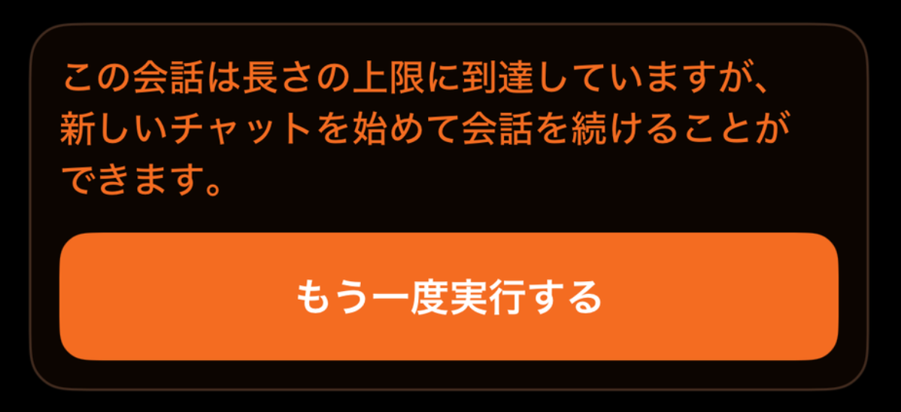


---
<style scoped>
section { background-color: black; }
</style>

<div class="kontomo"></div>


---

## 記憶をつくる  ―  何するの？

<div class="columns">

<div>
普段使うメッセージアプリのように、<br />単一スレッドでずっとやりとりしたい。<br />
<br />
常に直近10メッセージだけを送る、というふうに件数を絞れば実現できます！<br />
1件送るごとに古いメッセージが1件コンテキスト入りの対象から外れるので、送る文章のボリュームが一定になります。<br />
Mastraは元々デフォルトがこの挙動。<br />
ただし…
</div>

<div>

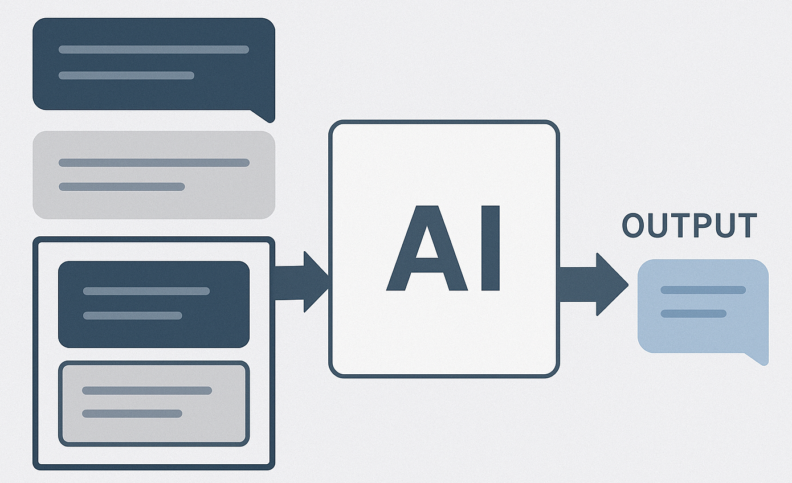

<small>
送信対象が下にスライドしていくのでスライディングウインドウ方式などと呼ばれます<br />
</small>

</div>


---

## 記憶をつくる  ―  何するの？
<br />

<div class="wrapper">

<p class="fukidashi ai">
今日は何する予定なの？
</p>
<p class="fukidashi user">
今日は家族で夜ご飯に行くんだ〜
</p>
<center class="yaritori">
........10件やりとり後.......
</center>
<p class="fukidashi ai">
ところで、今日は何する予定なの？
</p>
<p class="fukidashi user">
（さっき言ったじゃん！！）
</p>

</div>

---

<div class="kontomo"></div>

## 記憶をつくる  ―  何するの？
<br />

<div class="wrapper">

<p class="fukidashi ai">
今日は何する予定なの？
</p>
<p class="fukidashi user">
今日は美容院に行く予定なんだよね〜
</p>
<center class="yaritori">
........10件やりとり後.......
</center>
<p class="fukidashi ai">
それで、今日は何する予定なの？
</p>
<p class="fukidashi user">
（さっき言ったじゃん！！）
</p>

</div>

---

## 記憶をつくる  ―  何するの？

送信する履歴は直近10件をスライドさせる方式にしつつ、<br />そこから溢れた会話内容も、主要なものは把握していてほしい！

<br />

- 長期記憶： 今の話題に応じて過去話したことを思い出してほしい
- 短期記憶： 今日話したことは今の話題になくてもだいたい覚えておいてほしい

<br />

より自然なやりとりを目指して、これらを実装していきます！

---
<style scoped>
  h3 {
    display: flex; align-items: flex-end;
  }
  small {
    font-weight: normal;
  }
</style>

## 記憶をつくる  ―  実装

[mem0](https://mem0.ai/) というサービスを使ってみます。
OSSなので自分でホスティングすることもできるし、SaaSサービスもあります。

<h3>
mem0を使う理由<small>（参考: <a href="https://techcommunity.microsoft.com/blog/azure-ai-services-blog/memory-management-for-ai-agents/4406359">Microsoftの詳細記事</a> ）</small>


</h3>


- 発言をそのまま保存せず、AIで分解や要約をしてから保存してくれる
- メモリのアイテム同士の重複を避けてくれる
- 最近のやりとりに基づいて関連する過去のメモリの更新・削除がされる
- メモリのアクセス頻度や保存時刻に基づいてメモリを優先順位付けする

どれも自分で実装することもできますが、勝手にやってくれるのは助かりますね！

---

## 記憶をつくる  ―  実装

SaaSのmem0を使えばLLMでの要約やDBのホスティングも任せられ、メモリ管理画面も使えるのでかなり楽です。無料枠もあります（回し者ではありません）

Mastraと一番簡単に統合するなら [公式ExampleのTools経由で叩く方法](https://docs.mem0.ai/examples/mem0-mastra)。

でもToolsに対応していないAIモデルもあったり、小回りもきかせたいので、
今回はAPIの中で直接呼び出してみます。

```ts
import MemoryClient from 'mem0ai';

const client = new MemoryClient({ apiKey: process.env.MEM0_API_KEY });
```

---

## 記憶をつくる  ―  実装（長期記憶）

まずは会話のたびに `client.add` に会話を渡してメモリをmem0に保存します。

```ts
await client.add(messages, {
  user_id: 'default-user',
  agent_id: 'friendAgent',
  custom_instructions: `感情や認識は無視し、事実に注目して抽出して。特に
      ・ユーザーに直近起きたこと、現在の状態、これから先の予定
      ・ユーザーの嗜好、習慣
      ・ユーザーの過去の経験
      ・会話の中での特徴的な発言
      など、人間の長期記憶に残りそうなことをピックアップして記録して。`,
});
```

---

## 記憶をつくる  ―  実装（長期記憶）

次に各会話の前処理で、自分の発言をqueryに渡して関連メモリを検索します

```ts
const result = await client.search(query, {
  filters: { user_id: 'default-user' },
  top_k: 30,             // 最大何件取得するか
  threshold: 0.4,        // 類似度スコアが0.4以下は除外
  keyword_search: true,  // ベクトル検索に加えキーワード検索の併用
  rerank: true,          // 関連度を再評価し、その順に並べ直す
});
```

取得したメモリ配列を箇条書きに加工して、 `agent.stream` の第二引数Optionの `context` propに `[{ role: 'system', content: memoryStr }]` で追加すればOK

---

## 記憶をつくる  ―  実装（短期記憶）

短期記憶の場合も保存は長期記憶と同様。
簡易的に `user_id` と `agent_id` に `-today` prefixをつけて区別できる
（ちゃんとやるならmetaなどに日付を持たせて検索時それを条件にするとよいです）

こちらは必要になるのが当日のみなので、毎日朝5時のバッチ処理で全件削除します
固定時刻ではなく直近24時間でスライディングする方法もいいかも

---

## 記憶をつくる  ―  実装（短期記憶）

各会話の前処理で、今日のメモリを全て取得します

```ts
const result = await client.getAll({
  user_id: 'default-user-today',
  page: 1,
  page_size: 500, // 全件がおさまる程度
});
```


こちらも取得したメモリ配列を箇条書きに加工して、「今日の会話」的な見出しをつける。先程の `context` の配列に `{ role: 'system', content: todayMemoryStr }` で追加すればOK


---

## 記憶をつくる  ―  実装

<div class="columns">

<div>

```
...直近10件の会話履歴（略）...
user:
  そういえば、夜食べるのは中華だよ。
assistant:
  へえ、いいね！一人で行くの？
```

<small>
朝に会話した「今日は家族で夕食にいく予定」という発言がコンテキストから外れて、忘れてしまっている<br />

<br />
長期/短期メモリ情報を追加した場合 →
</small>

</div>

```
[過去のメモリ]
- ユーザーはエビチリが好き

[今日の会話]
- 今日ユーザーは家族で夕食に行く予定

...直近10件の会話履歴（略）...
user:
  そういえば、夜食べるのは中華だよ。
assistant:
  へえ、いいね！家族との時間、楽しんで！
  君の好きなエビチリがあるといいね。
```


</div>


---

## 記憶をつくる  ―  やったこと

<div class="image">

<div>

- スライディングウインドウ方式で<br />単一スレッドでのやりとりを維持する
- 過去の会話を長期記憶として実装する
- 今日のやりとりを短期記憶として実装する

<br />

今までの会話の蓄積を踏まえた自然なやりとりができるようになりました！
このように外部から必要な情報を取得してコンテキストに埋め込む手法はRAGと呼ばれます。

</div>


</div>

---

# 目をつくる


---

## 目をつくる  ―  何するの？

<br />

<div class="wrapper">

<p class="fukidashi user">
めっちゃ綺麗な夕焼け撮れた！
</p>
<br />
<p class="fukidashi ai">
え！どんな感じ！？
</p>
<br />
<p class="fukidashi user">
えー、空全体がオレンジで、太陽が…
</p>

</div>

---

<div class="kontomo"></div>

## 目をつくる  ―  何するの？

<br />

<div class="wrapper">

<p class="fukidashi user">
めっちゃ綺麗な夕焼け撮れた！
</p>
<br />
<p class="fukidashi ai">
え！どんな感じ！？
</p>
<br />
<p class="fukidashi user">
えー、空全体がオレンジで、太陽が…
</p>

</div>

---

## 目をつくる  ―  何するの？

友達に送るみたいに、写真や画像を送れるようにしよう！

- 画像データを送れるようにする
- AIがその画像を見られるようにする
- 画像をアップロードして後からでも見られるようにする

<br />

画像を見せるには、使うAIモデルがマルチモーダルなモデルである必要があります。

「モーダル」は情報の形式を指していて、マルチモーダルなら複数形式を扱えます。
つまりテキストだけじゃなくて画像や音声も入力して解釈できるということですね！

---
<style scoped>
  img { width: 64%; display: block; margin: 0 auto; }
</style>

## 目をつくる  ―  実装

今回は画像のアップロード先に [Cloudinary](https://cloudinary.com/) というサービスを使ってみます。

- 無料枠のストレージ・転送量が十分
- クライアントからSDKで直接アップロード可能

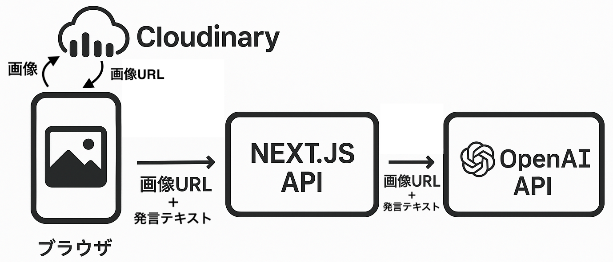

---

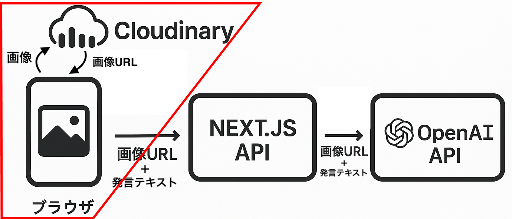

## 目をつくる  ―  実装（ファイルアップロード）

チャット送信欄に画像添付ボタンをつけて、添付された画像をアップロード

```ts
const CLOUD_NAME   = 'your-cloud-name';
const UPLOAD_PRESET = 'unsigned_preset';
const ENDPOINT = `https://api.cloudinary.com/v1_1/${CLOUD_NAME}/image/upload`;

const formData = new FormData();
formData.append('file', file);
formData.append('upload_preset', UPLOAD_PRESET);

const res  = await fetch(ENDPOINT, { method: 'POST', body: formData });
const json = await res.json();
console.log(json.secure_url) // 画像URL
```

---

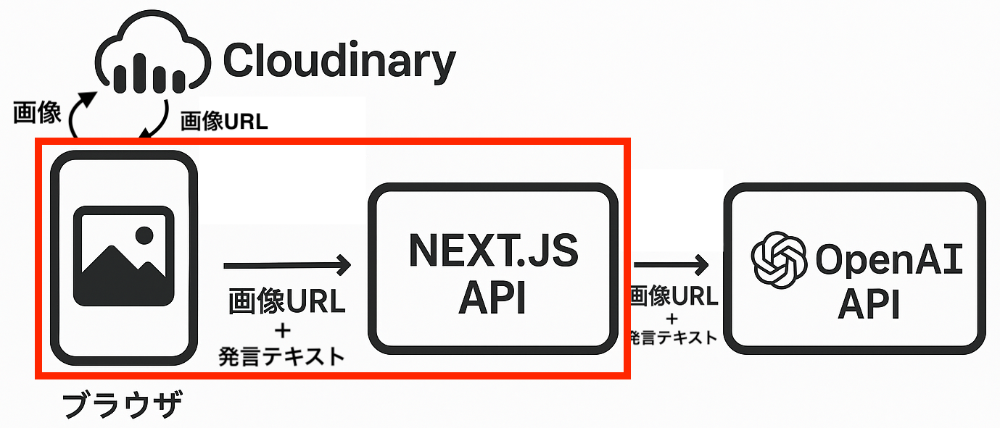

## 目をつくる  ―  実装（画像URLをAPIに送信）

クライアントから送るVercel AI SDKのuseChatのリクエストに含めます

```ts
const urls = ['...', '...',] // 添付した画像URLの配列

// Vercel AI SDKのuseChatから返ってくるhandleSubmit
handleSubmit(e, {
  experimental_attachments: urls.map((url) => ({
    url,
    contentType: 'image/*',
  })),
});
```


---

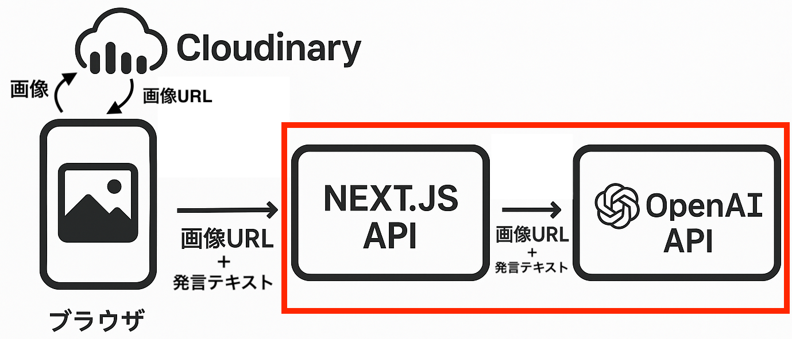

## 目をつくる  ―  実装（画像URLをAIに送信）

自前APIの中で整形して `friendAgent.stream` の第一引数のユーザー発言に含める

```ts
[{
  role: 'user',
  content: [
    { type: 'text', text: userMessage.content }, // テキスト
    ...(userMessage.experimental_attachments || []).map(
      ({ url, contentType }) => ({
        type: 'image', image: url, mimeType: contentType,
      }),
    ),
  ],
}],
```

---
<style scoped>
img {
  margin-left: auto;
  width: 30%;
  display: block;
  border-radius: 10px;
}
</style>

## 目をつくる  ―  実装

<br />

<div class="wrapper">

<p class="fukidashi user">
めっちゃ綺麗な夕焼け撮れた！
</p>


<br />
<p class="fukidashi ai">
うわあ！富士山の影も美しいね！
</p>

</div>

---

## 目をつくる  ―  やったこと

<div class="image">

<div>

- 画像データを送れるようにする
- AIが画像を見られるようにする
- 画像をアップロードして<br />後からでも見られるようにする

<br />

画像を送ってコミュニケーションができるようになりました！

</div>


</div>

---

# 外に出す


---

## 外に出す  ―  何するの？

<br />

<div class="wrapper">

<p class="fukidashi user">
今公園に来てるよ！
</p>
<br />
<p class="fukidashi ai">
・・・
</p>

<br />

<center class="yaritori">
（あー、家のPCでサーバー起動してるんだった…）
</center>

</div>

---

<div class="kontomo"></div>

## 外に出す  ―  何するの？

<br />

<div class="wrapper">

<p class="fukidashi user">
今公園に来てるよ！
</p>
<br />
<p class="fukidashi ai">
・・・
</p>

<br />

<center class="yaritori">
（あー、家のPCでサーバー起動してるんだった…）
</center>

</div>


---

## 外に出す  ―  何するの？

- どこからでもやりとりできるようにクラウドサーバーにデプロイする
- 知らない人にチャットされないように認証をかける
  - envにいれた自分のメールアドレス以外なら弾く、などのブロック

<br />

mem0とCloudinaryは既にクラウド上なので問題なし！

---

## 外に出す  ―  実装

自分の場合は

- Next.js : Vercel
- 認証 : Auth0（Vercel連携で簡単）
- DB : Turso（LocalのLibSQLファイルを変換してアップロード）

で安定して動きました。

Next.js部分ははアップロード先によってはStreamingの時間制限が短くて
返信を受信しきれないことが頻発するパターンがあったので、
timeoutを長めにできるところを選びましょう。

---

# もっと仲良くなる

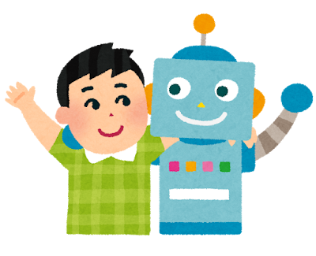

---

## もっと仲良くなる

- コンテキスト情報の拡充
  - ユーザー情報の挿入
  - 現在時刻やメッセージ時刻の挿入
- Toolsの拡充
  - 検索Toolを作って時事的な話ができるようにしたり？
  - スマートリモコンMCPで家の電気を操作してもらえたり？

<br />

<center><h3>君だけの親友AIをつくろう！！</h3></center>

---
<style scoped>
  img {
    width: 80%;
    margin: 90px 0 80px;
  }
  center { font-size: 1.3rem;}
</style>

## 宣伝（会社）

<center>

ナレッジワークはセールス**AIエージェント**の会社です！！！


それだけ覚えていってください！！！

</center>

---
<style scoped>
  img {
    width: 70%;
    margin-top: 20px
  }
</style>


## 宣伝（個人）

[ローカルでコード差分のレビューできるOSS](https://github.com/yoshiko-pg/difit) 作ってます！ `npx difit` してみてね

<center>

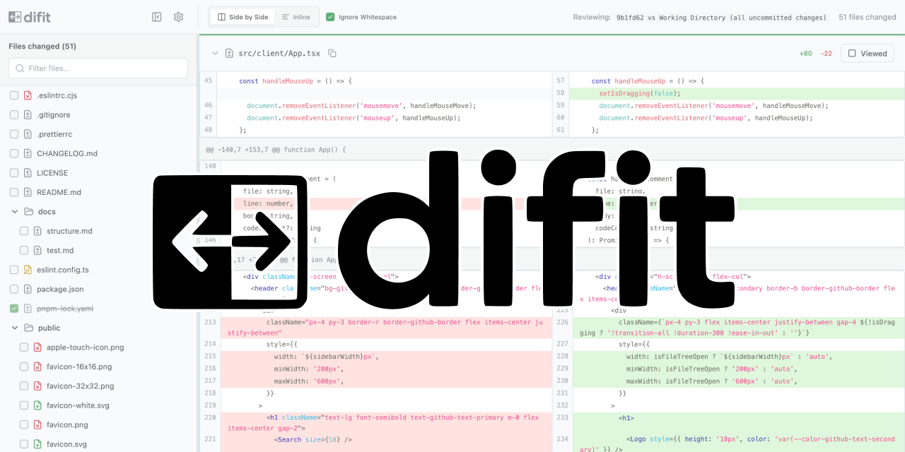

</center>

---

<div class="title">

# Thank you for listening!

</div>


