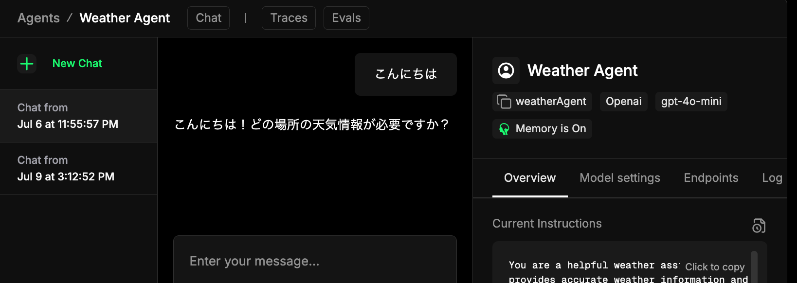

<style>
@import url('https://fonts.googleapis.com/css2?family=Noto+Sans+JP:wght@400;700&display=swap');
section{
  font-family: 'Noto Sans JP', sans-serif;
}
pre, code {
  line-height: 1.5;
}
</style>

# AIで造るオーダーメイド親友

<br />
<br />
<br />
<br />
<br />

2025/07/13  CoLab Conf
@yoshiko

---


---

ZennのAIカテゴリで、次トークするmizchiさんの全部賭けろ記事に次いで2位になってます

---

## 今日話すこと

友達づくりを通して、AIチャットの基本的な仕組みと実装方法を学ぼう！

まず各セクションの「なにするの？」で汎用的なAIチャットの仕組みを解説します。

そのあとの実装は主に自分の慣れているフロントエンド周りの技術で作りますが
仕組みを理解してもらえていれば、どの言語/技術で作っても同じです。

オリジナリティのあるAIチャットはどうやって作るんだろう？がわかる発表になれば！

---

# 脳をつくる

<br />
<br />
<br />
<br />
<br />

Mastra

---

## 脳をつくる  ―  何するの？

- クラウドAIにカスタム指示をつけたAIエージェントをつくる
- AIエージェントにテキストを送って、返ってきたテキストを見る
- 会話履歴を保存する

<br />

まずは言葉を交わせるようになりましょう！

---

## 脳をつくる  --- Mastra

Mastraでエージェントのコア部分を作ります。

MastraはTypeScript製のエージェントフレームワークで、
AIエージェントをつくるのに便利な機能が標準搭載されています。

```sh
npx create-next-app my-app
cd my-app
npx mastra init
```

`npx create-mastra@latest` でMastra単体のAPIサーバーを作ることもできますが、
今回は Next.js ベースのプロジェクトの中に mastra のSDKをセットアップします

---

## 脳をつくる  --- Mastra

<div class="columns">

<div>

`src/app` と `src/mastra` ができます。
（`src/app` はNext.js App Router）

`.env` に使いたいAIモデルのAPI Keyを設定します

<small>
詳細手順: <a href="https://mastra.ai/ja/docs/frameworks/web-frameworks/next-js">https://mastra.ai/ja/docs/frameworks/web-frameworks/next-js</a>
</small>

</div>


</div>

---

## 脳をつくる

`npx mastra dev` でMastraのPlayground画面を立ち上げられます
最初はサンプルのWeather Agentが入っているはず
疎通を試してみましょう。チャット欄から会話してみて話せればOK！



---

## 脳をつくる

サンプルは消してオリジナルのエージェントを作ってみましょう！

```ts
// mastra/agents/friend.ts
export const friendAgent = new Agent({
  name: 'ともだちエージェント',
  instructions: `あなたはユーザーととても仲の良い友達です。落ち着いた話し方をします。`,
  // OpenAIの場合 .responses で 新しい Responses APIを使える
  model: openai.responses('chatgpt-4o-latest'),
  memory: new Memory(),
});
```

---

## 脳をつくる

- `instructions` にカスタム指示（性格、話し方など）を指定できます
- `model` で使うモデルを選べます。GeminiもClaudeもGrokもいけます


---

2. 顔をつくる — Next.js × Vercel AI SDK

useChat Hook

機能	ひとことで
ストリーミング	モデルの出力を逐次レンダリング
状態管理	ローディング・エラー・履歴まとめて面倒見てくれる
カスタム Body	追加メタデータを送信できる（例：timezone）

// app/chat/page.tsx
'use client'
import { useChat } from '@ai-sdk/react'

export default function Chat() {
  const { messages, input, handleInputChange, handleSubmit } = useChat({
    api: '/api/chat',
    body: { tz: 'Asia/Tokyo' }
  })
  /* …UI はお好みで… */
}


---

API ルート側

// pages/api/chat.ts
import { OpenAIStream, StreamingTextResponse } from 'ai'
import { assistant } from '@/agents/assistant' // Mastra instance

export const POST = async (req: Request) => {
  const { messages, tz } = await req.json()
  const stream = await OpenAIStream(assistant.run({
    messages,
    system: `ユーザーのタイムゾーンは${tz}`,
  }))
  return new StreamingTextResponse(stream)
}


---

3. 記憶をつくる — Mem0

LLMs は基本 “記憶喪失” → 外部ストレージで補完しよう

3レイヤー構成

レイヤ	保持期間	技術	用途
短期記憶	会話 10 メッセージ	Context Sliding	文脈維持
中期記憶	1日	Mem0 “daily” namespace	「今日あったこと」
長期記憶	無期限	Mem0 + Vector RAG	プロファイル / 好み

	•	Mem0 は Graph + Vector + KV をハイブリッドに管理し、個人情報をセキュアに保存

---

Mem0 実装例

import { createClient } from 'mem0'
const mem = createClient({ apiKey: process.env.MEM0_KEY })

export async function recall(userId: string, query: string) {
  const memories = await mem.search({
    namespace: 'long',
    userId,
    query,
    topK: 5
  })
  return memories.map(m => m.text).join('\n')
}

Tips: retrieval を system プロンプト に差し込むと「長期記憶→脳→短期文脈」の三段活用ができる

---

4. 目をつくる — Cloudinary 画像アップロード
	•	cloudinary.uploader.upload() で受け取った画像をホスティング
	•	URL をメッセージに添付し、Vision 対応 LLM に追加
	•	Cloudinary は 署名付き URL が作れるのでプライベートでも安心

const { secure_url } = await cloudinary.uploader.upload(filePath, {
  folder: 'ai-friend',
})
messages.push({ role: 'user', content: [{ type:'image_url', image_url: secure_url }] })


---

5. 仲良くなる — “Context Injection”
	1.	ユーザー情報
	•	名前、趣味、好みの温度感など
	2.	AI 人格
	•	一人称、口調、専門分野
	3.	時間情報
	•	現地時刻、曜日、祝日 etc.

const system = `
あなたは「優しいの友達AI」です。
今日の日付: ${new Date().toLocaleDateString('ja-JP')}
ユーザー名: xxx
ユーザーの趣味: xxxx
`


---

6. さらに広がる可能性

アイデア	使うツール	例
IoT 操作	Home Assistant API	「電気消して」→ webhook で照明OFF
スケジュール管理	Google Calendar API	「明日の昼にランチ入れて」
メール要約 & 返信	Gmail API + LLM	新着メールを TL;DR + Draft
健康管理	Wearable API	睡眠スコア→ bedtime 提案


---

よくある落とし穴
	1.	プロンプト肥大化
	•	context sliding／メモリ retrieval のバランスをチェック
	2.	コスト爆発
	•	Token 使用量 × LLM 単価 → metric で監視
	3.	個人情報の扱い
	•	Mem0 は SOC2 / HIPAA 対応だが、自社基準も忘れず
	4.	モデル切替の自由度
	•	Mastra で abstraction しておくと楽

---

まとめ
	1.	レイヤーで考えると迷わない
	2.	Mastra × Mem0 × Vercel AI SDK で最短 MVP
	3.	人格 & 記憶を設計すれば “友達AI” は1日で誕生
	4.	次の一歩: Tool 連携で “リアルの友達” 並みに役立つ存在へ

---

参考リンク
	•	Mastra GitHub: https://github.com/mastra-ai/mastra
	•	Mem0 Docs: https://docs.mem0.ai
	•	Vercel AI SDK: https://ai-sdk.dev
	•	Cloudinary Docs: https://cloudinary.com/documentation

---

Q & A

なんでもどうぞ！
