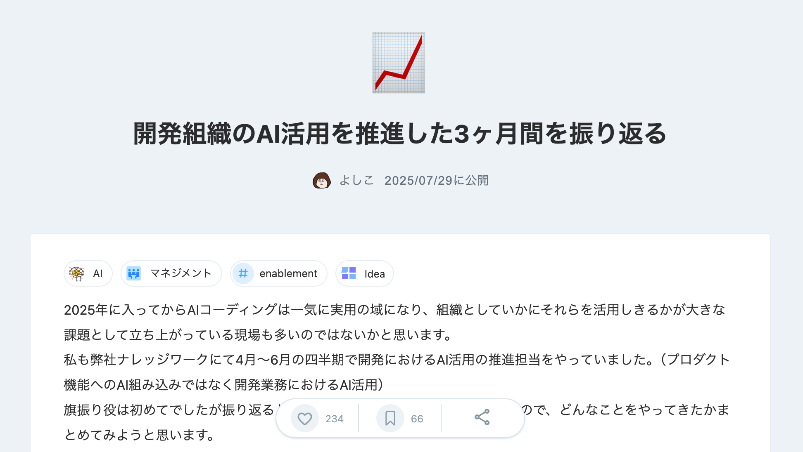
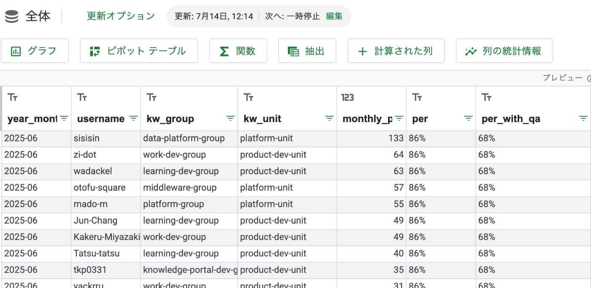
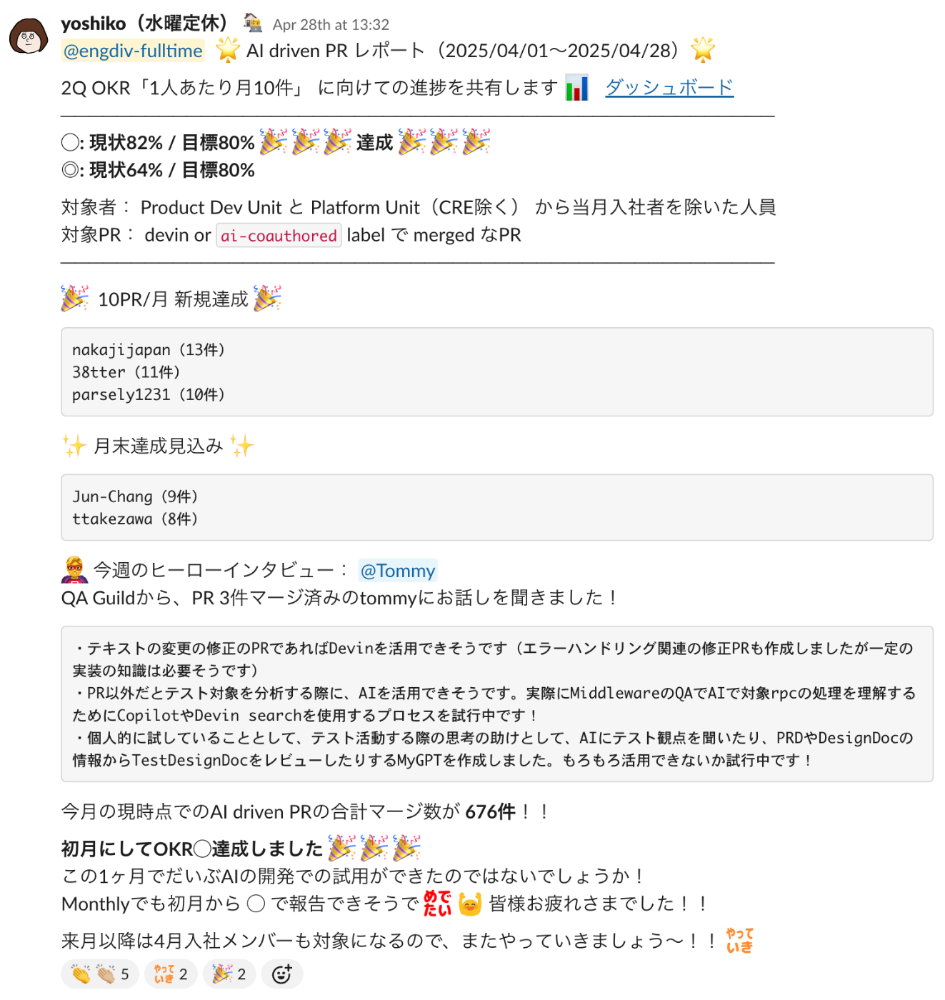
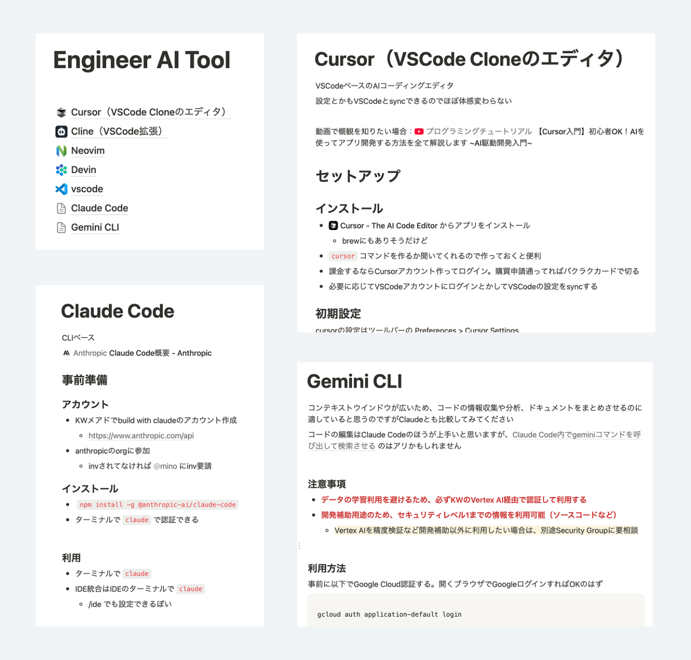
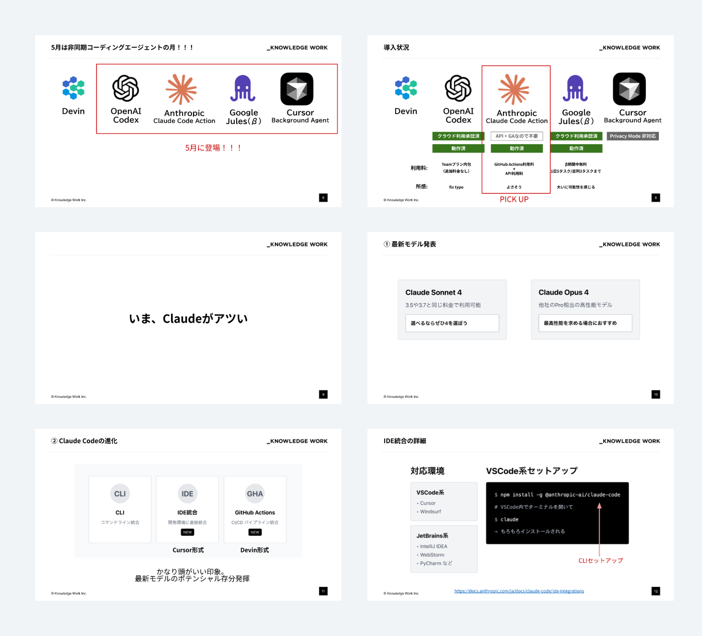
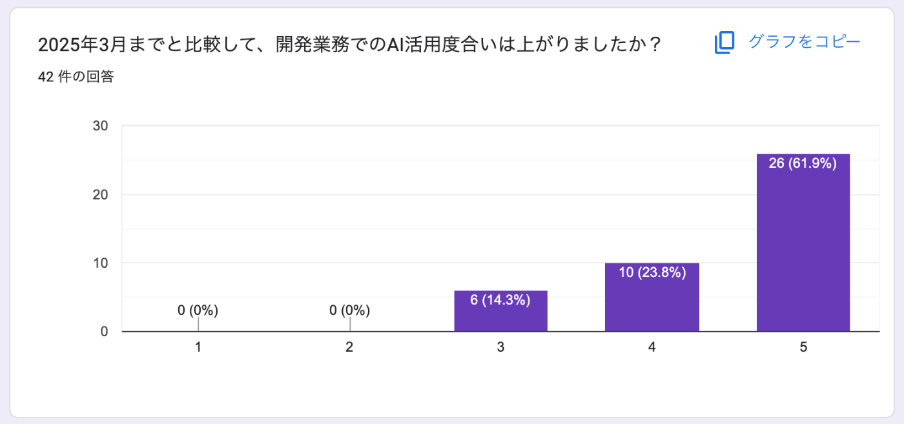
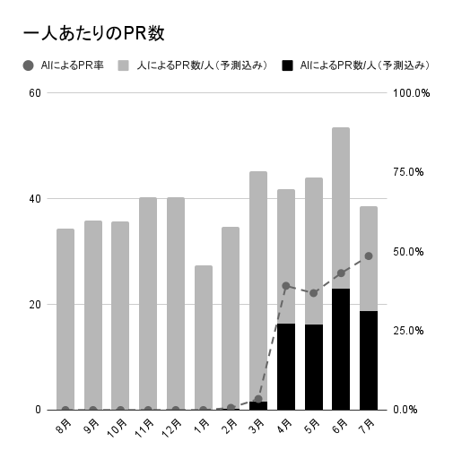
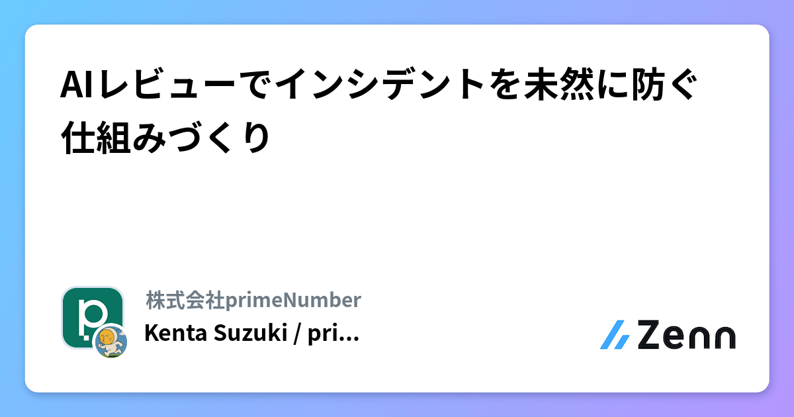
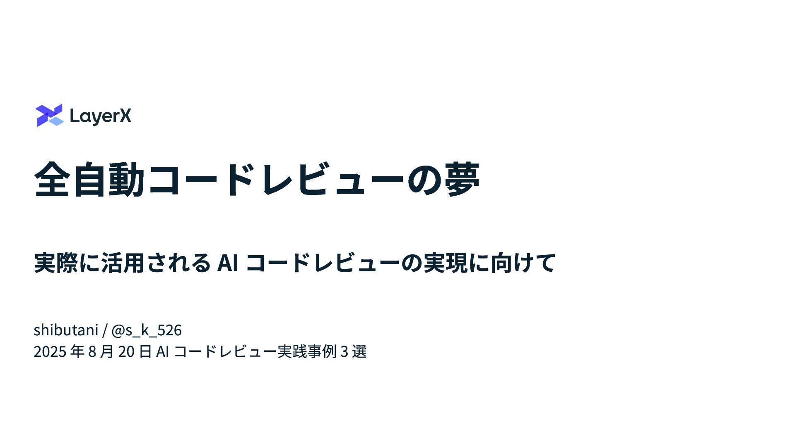
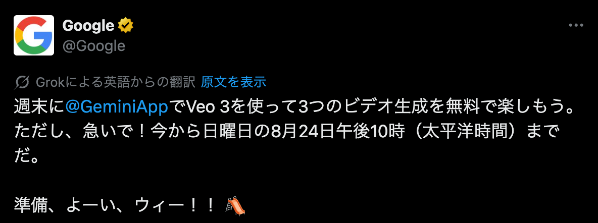

# AI活用推進の舞台袖

## @yoshiko_pg

<!-- 
本日は社内勉強会にお招きいただきありがとうございます。

先日、エンジニア組織でのAI活用推進をしたという記事を書いたのですが、そこからお声がけいただいたということで
その内容の深掘りと、記事で書ききれなかったことも含めて
裏話というところまでの裏っぽい話はないですが、広がりはあるので、舞台裏じゃなくて舞台袖としてみました。

組織にAI活用文化を浸透させるためにはどうしたらいいのかというのを一緒に考えていければなと思っています。
-->

---

<!--
最初に簡単に自己紹介をさせてください。
よしこといいます。
15年ほどフロントエンドエンジニアをやっています。
営業向けのSaaSの会社で働いています。

-->

---

---

# 目次

 

## 01. 記事の深堀り
## 02. 課題
## 03. 押さえどころ

---

<!-- _class: section -->
<!-- _backgroundColor: #147bafff -->
<!-- _color: white -->
# 01
## 記事の深堀り

---

# 発端

<!-- 
まず、この話がどのような背景で始まったのか、
私がどのような立場で関わることになったのかをご説明します。
-->

---

## 全社単位でのAI活用プロジェクトの発足

### 2025年4月〜6月の四半期

<strong>全社目標：業務生産性の向上（10%~20%）</strong> 
AIを活用することで達成する、という前提

 

### 自分の役割
- エンジニア部署のAI活用推進担当
- エンジニア組織のAI活用に関する四半期目標のオーナー
- なぜ by name で任命されたのか？ 👉

<!-- 
私は2025年4月〜6月の四半期で開発におけるAI活用の推進担当をやっていたのですが、
そもそもなぜそういった推進担当を立てることになったのか。

今年の全社目標として、AI活用を前提とした業務生産性の向上が掲げられました。

今年の前者目標として「業務生産性の向上（10%~20%。AI活用が前提）」が掲げられており、エンジニア部署はエンジニア部署で進めることとなった。その旗振りを拝命。

人選については後半で触れます。
-->

---

# 2025年3月までの景色

---

<table class="timeline-table">
  <colgroup>
    <col class="col-date" />
    <col class="col-industry" />
    <col class="col-sep" />
    <col class="col-inside" />
  </colgroup>
  <thead>
    <tr>
      <th class="date-header"></th>
      <th colspan="2">業界</th>
      <th>社内</th>
    </tr>
  </thead>
  <tbody>
    <tr>
      <td class="date">2024年</td>
      <td>
        CursorやClineなどのコーディングエージェントによる開発革命が、
        アーリーアダプターの間で話題に 
        （今振り返ると、まだmodelが力不足）
      </td>
      <td class="sep"></td>
      <td>ちらほら記事が貼られる程度</td>
    </tr>
    <tr>
      <td class="date">2025年1月</td>
      <td>
        アーリーアダプターな企業でDevinやCursorを導入・活用し始めた話題が聞こえ始める
      </td>
      <td class="sep"></td>
      <td>
        全社 ChatGPT Teamを契約する話が持ち上がる 
        エンジニア内 Devin/Cursor/Clineを社内利用したい話が持ち上がる 
        → 月末にクラウドサービスの利用フローが策定される
      </td>
    </tr>
  </tbody>
</table>

<!--
このフロー策定されて使えるようになるまでの期間がもどかしくて、適宜ステータスを確認したりしていました
他社が既に使い始めて変革が起きていそうなところから焦りがあり、ヒアリングなどをしていました
社内ニーズが高まってからではあるものの、セキュリティ・法務も迅速に対応してくれたと思います
-->

---

<table class="timeline-table">
  <colgroup>
    <col class="col-date" />
    <col class="col-industry" />
    <col class="col-sep" />
    <col class="col-inside" />
  </colgroup>
  <thead>
    <tr>
      <th class="date-header"></th>
      <th colspan="2">業界</th>
      <th>社内</th>
    </tr>
  </thead>
  <tbody>
    <tr>
      <td class="date">2025年2月</td>
      <td>
        <a href="https://x.com/karpathy/status/1886192184808149383" target="_blank">
          Vibe Coding
        </a>,
        <a href="https://www.oreilly.com/radar/the-end-of-programming-as-we-know-it/" target="_blank">
          The End of Programming as We Know It 
        </a>,
        <a href="https://zenn.dev/mizchi/articles/all-in-on-cline" target="_blank">
          CLINEに全部賭けろ
        </a>
        など明確な変革期を訴えかける発信が重なり話題が広がる 
        Claude 3.7 Sonnet がリリース
      </td>
      <td class="sep"></td>
      <td>
        全社 ChatGPT Team, Gemini, Notion AIを利用開始 
        エンジニア内 策定された利用フローの遂行者が曖昧で導入が進まない 
        自分 フローに則って申請状況を整理・段取り、2月半ばから利用開始
      </td>
    </tr>
    <tr>
      <td class="date">2025年3月</td>
      <td>
        コーディングエージェントとAIの潮流が話題を席巻し始める 
        反応は人によって様々
      </td>
      <td class="sep"></td>
      <td>
        自分 Claude Codeなど各種AIツールの申請と社内共有を繰り返す 
        → <b>AI活用プロジェクトのリーダーを打診される</b>
      </td>
    </tr>
  </tbody>
</table>

<!--
ここが一番裏話っぽいかもしれません

申請フローは策定されたものの、予算との紐付けや誰が申請するのか？が不透明で、
フロー策定側は仕事が終わっている認識、現場は利用OKの号令を待っている、のような形でフロー策定後数週間経っても利用開始ができていなかった

申請についてAI部署やマネージャーやCorpITの間でボールが行き巡り、かつ実際の利用者ではなかったので他の業務に圧迫され、実質進んでいない状況だった
黎明期だったので情報が混乱しがちで、セキュリティチェック・法務チェックのステータスも現場に届いておらず、通っているのに待っているのような状況が起きうる状態だった

（自分が早く使いたかったので）情報を掴みにいき、各種ツールの申請状況経費申請のやりかたの把握、自部署での稟議申請、部署単位ではなく現場から申請をあげていく形というのを周知するなどの動きをして2月半ばからDevinとCursorが使えるようになった
※ 自分だけが動いていたのではなく感度の高いエンジニアが数人それぞれつついてくれてはいた
「Devinの検討ってどうなっていますか？」
「Cursorって利用検討されていたと思いますが申請状況どうですか？」
「Clineってあとどういうフローを踏めば使えるようになるのでしょうか？」
-->

---

## 振り返ってのポイント: 個人側

### 🔥 衝動や危機感を持ったら行動する

- **「使ってみたい」「使える会社にならなきゃヤバい」** という危機感
  → 待つだけではなく周りに働きかけ、突破口を開く
  - あと何がクリアされれば使えるようになるのか？
  - ボールの所在地をはっきりさせることで動き出すことが多い
- 気が急いてもShadow IT的に使い始めない
  - 前科をつくらない

<!-- 
- 使ってみたい、使える会社にならなきゃヤバい。という危機感を持ったら、周りに働きかける
    - （もちろん自分だけが動いていたのではなく、社内のAIエンジニアやセキュリティも動いていた）
- とはいえ全員が現場のエンジニアの目線を持っているわけではない。たとえばセキュリティ部署視点で利用ルールが策定されても、現場のエンジニアがフローを理解して申請の動きを取り始めるまでには結構なギャップがある。一人が突破口を開ければあとについていくのは楽になるので、使いたければステークホルダーに働きかけて突破口を開き、周りのメンバーに歩き方を広めていくといい
    - たとえば稟議申請の記載などは事前の見積書がなかったり項目などなど悩みどころだが、一度誰かが通せればその書き方に準じればいいので、自分が通したものを共有したりしました
- どうしたら公式に使えるのか？をクリアにし、ルールの整備を後押しする。Shadow IT的に勝手に使い始めない。
-->

---

## 振り返ってのポイント: 会社側

### 📑 ルールと実状のギャップを埋める

- ルールが策定されてもすぐに皆が運用に乗れるわけではない
- 稟議例の共有など「こう動けばいい」を明確化して目の前に差し出す

### 👥 関心の高い人を推進者としてアサインする

- 使いたくて勝手に動いている人、timesでブツブツ言っている人
- **AI関連は関心が高くないと追いきれない**
  -  AIは市場もツールも流れが早く、業務上必要だからキャッチアップする、では追いきれないと感じる（本人も辛いはず）

<!-- 
- プロジェクトの人選について。関心を持って勝手に動いている人間やtimesでブツブツ言っている人間が一人はいるはずなので、関心の高い人を選ぶ。
    - AIは市場状況もツールもとにかく流れが早く、それを追い続けて最適解を出し続けるには高い関心が必要。業務上必要だからキャッチアップする、では追いきれない部分がある
-->

---

# 目標設定

<!-- 
次に、具体的にどのような目標を設定し、どのようにKPIを定めたかをご説明します。
-->

---

## 全社の年間目標

<strong>業務生産性の向上（10%~20%）</strong> をAIを活用することで達成する

 

### ポイント
**「未来の採用計画を圧縮しても事業計画の達成およびそのための開発が成立している」**

現在以降の採用計画を削減し、その人件費をツール費としてROI 1倍以上を達成したい

<!-- 
全社OKRオーナーのHRマネージャーと、エンジニア責任者のVPoEと3人でミーティング。期待とゴールを握る

### 全社の年間目標

- ここから先の採用計画を削減する予定で、その削減分の人数に対して、充てたツール費をROI1.0倍以上で運用したい
- つまりゴールは「採用計画を圧縮しても事業計画達成およびそのための開発が成立している」

リソースが予定していた人数より少なくなっても問題なく開発ができること。言ってしまえば開発生産性の向上
-->

---

## 目標設定の要素分解

全社の年間目標を4~6月の短期・Eng部署にフォーカスした目標に落としたい

  

    
1

    

      <strong>年末の生産性向上のためには、早期のAI利用慣れが必須</strong> 
      現状は一部メンバーのみの利用に留まっている
    

  

  

    
2

    

      <strong>最初は生産性が下がることを想定</strong> 
      新しいスタイルへの適応にはリードタイムが必要
    

  

  

    
3

    

      <strong>広いメンバーの利用開始と継続を最優先</strong> 
      4-6月でしゃがんでも、7月以降の向上を狙う
    

  

<!-- 
まだ抽象度が高いのと、上記は年内いっぱいの中期ゴールではあるので、4~6月の短期・Eng部署にフォーカスした目標にしたい。

AIを使えば中期的には開発生産性は上がると思われる。が、開発者やチームがAI前提のスタイルに慣れるリードタイムは短くないはず。年末に開発生産性を上げておくには、まず大多数のメンバーが早めにAI利用に慣れておくことが必須。現状は利用は一部のメンバーに留まっている。

最初のステップでは開発生産性を測るのはむしろ悪手だと考えた。スタイルを変えれば最初は生産性は下がるもの。それを逆風にするとむしろ利用を阻害してしまう可能性がある。もし4-6月でしゃがんでもそのぶん7月以降に上がっていけば問題ない。
-->

---

## エンジニア部署の目標決定

80%以上

の開発メンバーが

10件/月 以上

AI主体のPull Requestを出す

<!--
CTOとも案出しをし、「広いメンバーが利用開始し継続的に利用に慣れること」を主眼に、 「開発メンバーのうち80%以上が、AI主体のPull Requestを月あたり10件以上出している」 という目標に定めた
-->

---

## 振り返ってのポイント: 会社側

### 📈 組織目標に入れることが重要
- AI活用を本気でやるという**経営からのメッセージ**となる
- 現場全体でこれを追うインセンティブが生まれる
  - 自分からおのずと習慣を変えてくる動きは期待値に入れないほうがいい
  - 過去慣性は想像以上に強いので外側から力を加えるのが重要
- 組織目標まわりの動きは現場メンバーのボトムアップな動きでは限界がある
  → **上級職のサポートが必要**

<!-- 
- 部署目標に入れることと、どの指標を追うかの設定は非常に重要。ここがひとつめのボタン
- 部署目標に入らないと経営からのメッセージとならないし、現場も全体で追うインセンティブがない
- 一方で部署目標の話になるとボトムアップでは限界のある部分なので、一定のレイヤー以上で意思決定に働きかけられる部分も必要。それが重なる人員か、もしくは理解ある上級職をサポートに付かせる。
    - たとえば掲げる目標が担当者の意思介在のないままマネージャー層で決められる、などだとギャップが生まれてしまい難しくなる
-->

---

# 推進施策

4月に入ってからやったこと

<!-- 
ここからは4月に入ってやったこと
まず指標を可視化しました
-->

---

## ダッシュボードの作成

<!-- 
部署内のデータプラットフォームチームに協力してもらい、いつでも全体と組織グループ別の数字を見られるようにした。部署目標なので話も早く、この協力もスムーズに連携できた（人柄もあるが）

- **全体と組織グループ別の数字**をリアルタイム表示
- グループマネージャーが自チームの状況をウォッチ
- デイリースクラムで活用施策を議論するグループも
-->

---

## 週次レポートの配信

---

## 週次レポートの配信

以下の構成で飽きられないように工夫していました

### 📊 数値の共有
- 現在の達成率
- 新規達成メンバーの掲載
- 月末達成見込みメンバーの予測

### 🎤 ヒーローインタビュー
- うまく活用しているメンバーへヒアリング、コメントを依頼
- 具体的な活用事例の共有

レポート作成はChatGPTのプロジェクト機能で半自動化していました

<!-- 
目標数値に加え、その週で新規に達成したメンバー/月末達成見込みメンバーのフィーチャリングや、うまく活用していそうなメンバーへのヒーローインタビューも実施

レポートはChatGPTのプロジェクトに雛形の文面を登録し、週ごとにチャットへ数値データをJSONなどで貼り付けることで算出可能な部分は自動化

とはいえ流されてしまわないように毎回オリジナルのコンテンツ（インタビュー）も短く盛り込んだ
-->

---

## AI活用情報の発信

## 📚 利用ドキュメント整備
- 各種AIツールの使い方をまとめる
- 雑にでもセットアップ方法を伝達

## 🚀 新規AIサービスの申請
- 良さそうな新ツールを知ったら申請
- 使いたければ使える状況に

## 💬 Slackでの情報共有
- AI情報専用チャンネル
- ネットで話題を見たら投稿してみる

## 🗣️ 月例会での発信
- 毎月5-10分の発信時間を確保
- AI界隈の最新動向と、社内で今月新しく使えるようになったツール紹介

---

## AI活用情報の発信 - 利用ドキュメント

<!-- 
各種AIツールの使い方を社内ドキュメントにまとめておく。雑でいいので。
-->

---

## AI活用情報の発信 - 月例会での発信

<!-- 
エンジニアの月例会でその月のAI動向や今月使えるようになったツールを紹介
-->

---

## 振り返ってのポイント: 個人側

### 📣 繰り返しの発信が重要

- 一度聞いただけで受け取れる人はほとんどいない
- 目標数値もAI動向も、繰り返し発信することで何回目かで刺さる
- 自分がいろいろな情報を知っておく必要がある
  - 自分が楽しんで情報収集できていればそれを横流しするだけ

---

## 振り返ってのポイント: 会社側

### 💰 予算確保の工夫
- ツール名ではなく**AIツール予算という枠で確保**（エンジニア数 * $200 など）
  - トレンドに応じた柔軟な乗り換えを可能に
- 事前に予算枠確保の稟議を通すことで都度の稟議不要で迅速な導入が可能

### 🔄 柔軟な運用
- 割高でも **月単位契約** 推奨
  - トレンドに応じた柔軟な乗り換えを可能に
- メンバー単位で使いたくなったら開始、使わなくなったら解約
  - アカウントは把握しておき棚卸し可能に

<!--

費用に関しては、開発補助AIサービスの予算が「エンジニア数*$200」で事前に稟議申請通過しており、都度の稟議申請が不要で事後経費精算のみすればよかったのが良かった

ツールの流れが速いので、ツールごとではなく枠で確保して移りやすくしておくことは重要

ツールによってオーガニゼーション管理の有無やエンタープライズプランの有無なども違うので、契約状況を把握して定期的に棚卸しできる状態を保つのも重要

使いたくなったら気軽に始めて、使わなくなったら解約、を短いサイクルでできるように

今の状況だと基本的に割高でも月単位がよい
-->

---

# 結果

6月末の状況

<!-- 
ここからは、3ヶ月間の取り組みの結果と、見えてきた課題についてお話しします。
-->

---

✅ 目標達成

目標80%に対して、 <b>86%</b> のメンバーが10PR以上達成

---

## 定性アンケート

---

## その後のAI活用割合

7月にはAI主体のPRの割合が50%程度に
部分利用を含めるともっと多い

最初は一時的な生産性低下も考慮していたが、期初の4月やGWのあった5月でもPR数が凹んでいなかったのは良い傾向

---

<!-- _class: section -->
<!-- _backgroundColor: #147bafff -->
<!-- _color: white -->
# 02
## 課題

---

# 過去慣性の強さ

---

## 目標と習慣の壁

- 今まで築いてきた仕事のやりかたは想像以上に染み付いている
  - 推進していた自分すら、休暇明けにエージェントを使うのを忘れていた
- 一時的に目標に入れて利用頻度が上がっても、それが習慣になったわけではない
  - **発信し続けること** や **経営からの継続的なメッセージ** が大切

<!-- 
- 周りに対しては、部署目標に入っている期間だけ、その指標のことを頑張る、ぐらいの期待値でいたほうがいい。
-->

---

# 開発スピードは早くなったか？

---

## ボトルネックの移動

コーディング以外へボトルネックが移動し、全体のスループットが上がらない

  

    
1

    

      <strong>コードレビュー</strong> 
      PRの増加に対してレビュアーは増加していない
    

  

  

    
2

    

      <strong>QA・テスト</strong> 
      機能がたくさんできても今まで通りテストしきれない
    

  

  

    
3

    

      <strong>企画・デザイン</strong> 
      企画やデザインが上がってくるスピードは今まで通り
    

  

---

## コードレビュー

CI/CDは充実させていたので、静的検査できる範囲のことは元々チェックできていた

AIでの直接的なレビューとして、Copilot, Claude Code Action, CodeRabbitなどのレビューツールを試している。

ここは自社でも模索中。以下の記事の内容を試してみたい。

  

  

---

## QA・テスト

ユニットテスト・API IntegrationテストはAIでどんどん書けるようになっている

エンジニア以外、QAチームによるテストが課題
弊社のQAチームは以下でAI活用を試している
- Curosrを利用
- 社内MCPを利用して機能仕様書を取得
- それを元にテスト計画書の作成・レビュー
- Playwright MCPでテスト内容の実行を試す

近日中に記事が出る予定なのでぜひご覧ください

---

## 企画・デザイン

よく言われること
- 企画: KiroのようなSpec Driven Developmentや、ChatGPTでの仕様書作成
- デザイン: v0やBoltなどでプロトタイプを作成

ただ、そもそも `企画` → `デザイン` → `実装` という流れのままそれぞれをAIで短縮するのには限界がある

- エンジニアもKiroなどで仕様作成と開発を並行できるのでは？
- デザイナーも空ページ作成＋UI MCPで実際のコードに近いプロトタイプを作れるのでは？

職種の境界を溶かして、AI前提のフローを作り上げて根本的な速度向上をしたい

---

<!-- _class: section -->
<!-- _backgroundColor: #147bafff -->
<!-- _color: white -->
# 03
## 押さえどころ

<!-- 
紹介した例はひとつの成功例といえると思うのですが、振り返って、ふたつのポイントをあげたい
-->

---

## 業務を通じて慣れさせる

- 大半の人にとって、 **業務が初めてのAIコーディング実践場**
  - オフの時間で個人開発をしている人は少ない
  - 自費で契約するハードルが高い

- 既存技術は入社前にスキルを面接で測って入社だが、 **AIを活用するスキルは全員ゼロスタート**
  - プライベートでAIスキルをつけてもらえれば言うことはないが、期待値には入れないほうがいい
  - 組織浸透を進めていくうえではいかに業務の中で慣れさせるか、という考えが大事だと感じた

<!--
大半の人にとっては、業務での開発AI利用 = 初めてのAI開発利用

個人開発をしている人は多くないから。

その中で自費で契約開始するハードルもある。安くはない費用がかかるというのが今までの技術習得と少し異なる点。

今までの技術だと入社前にスキルがありそれを面接で測って入社、となるが、AIを活用するスキルは全員ゼロスタート。

プライベートでスキルをつけてもらえれば言うことはないが、組織浸透を進めていくうえではいかに業務の中で慣れさせるか、という考えが大事。外で勝手に覚えてくると思わない。

フローを整備しても、実際にそのフローにのっとって使い始められるかはまた遠い。

積極的な利用意向のない人まで含めて広く活用していくにはまずお膳立てが必要。

使ってみてからのめりこむ人もいる。
-->

---

## 推進担当者を立てる

- 推進役は必要。AIが好きな人を起用すべき。
    - 特に興味ないけど仕事として情報収集、では限界のある変化速度
    - 活用範囲も広く日々様々な発展があるので、好きでないと楽しくないと思う
    - 実行力や調整力も必要。現場メンバーの場合、 **上級職のサポートが重要**
- AIを好きになるきっかけ: **感動を得る**
    - 仕事が超早く終わった、とか
    - 勉強がものすごく楽しくなった、とか
    - 誰にも話せなかったことを話せる相手ができた、とか
    - 絵や音楽の生成で自己表現できるようになった、とか
    - Aniちゃんかわいい！でもいいかもしれない

<!-- 
- 推進役をひとり立てるのが大事
    - AI好きな人がいい
    - 好きじゃないことを仕事として情報収集するのには限界がある
    - 好きじゃないとやってて楽しくないし
- どうしたらAI好きになれる？
    - 感動を得よう
    - 仕事が超早く終わった、とか
    - 勉強がものすごく楽しくなった、とか
    - 誰にも話せなくて辛かったことを話せる相手になった、とか
    - 今までできなかったことができるようになった、とか
    - Aniちゃんかわいい！でもいいかもしれない
- 情報収集（好きになってから）
    - 情報収集はTwitterがおすすめ、というかTwitterにしか流れてこない
    - 海外のツイートもワンクリックで翻訳できるので読みましょう
    - リストを作って毎日眺めるのがおすすめです
-->

---

## 付録： 情報収集 おすすめアカウント

AIの情報収集はTwitterが圧倒的です。自分が普段見てるアカウントの一部を紹介

**公式アカウント**
- `@OpenAI` / `@ChatGPTApp`
- `@AnthropicAI` / `@claudeai`
- `@GoogleAI` / `@GoogleDeepMind`
- `@GeminiApp` / `@googleaistudio`
- `@xai` / `@grok`

**関係者**
- `@sama` (OpenAI CEO)
- `@gdb` (OpenAI President)
- `@DarioAmodei` (Anthropic CEO)
- `@alexalbert__` (Claude Relations)
- `@demishassabis` (DeepMind CEO)
- `@OriolVinyalsML` (Gemini co-lead)
- `@OfficialLoganK` (GoogleAIStudio)

---

## 付録： 情報収集 おすすめアカウント

**まとめアカウント**
- `@rowancheung` 海外の日刊AIニュースレターの創業者。ツイートもそんな感じ
- `@d_1d2d`  海外AIインタビューを日本語に翻訳して要点掲載
- `@ctgptlb`  ChatGPT研究所 日本語で最新情報まとめ

**日本の研究者**
- `@joisino_`  ブログがとても面白い
- `@ImAI_Eruel`
- `@chokkanorg`

**日本の開発者**
- `@laiso`
- `@azukiazusa9`
- `@mizchi`

---

## 付録： 情報収集 おすすめアカウント

日本語以外のツイートも1タップで翻訳できるので言語関係なくフォローできます

---

## 付録： 情報収集 おすすめアカウント

日本語以外のツイートも1タップで翻訳できるので言語関係なくフォローできます

---

# Thank You! 🚀

  <h2 >ご質問・ご意見をお聞かせください</h2>
  
  

    
<strong>記事もぜひご覧ください</strong>

      <a style="color: #3498db;" href="https://zenn.dev/knowledgework/articles/ai-dev-enablement" target="_blank">https://zenn.dev/knowledgework/articles/ai-dev-enablement</a>
  

  
  

    

      本日の内容が、皆様の組織でのAI活用推進の 
      一助となれば幸いです
    

  

