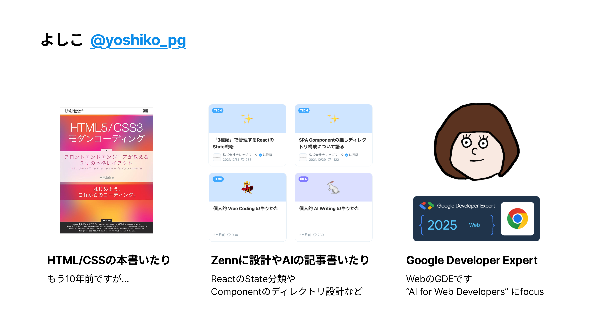

# AIプログラミング文化の組織浸透

## @yoshiko_pg

<!-- 
本日は社内勉強会にお招きいただきありがとうございます。
私からは、実際に社内でAIプログラミングツールの導入を推進した経験をもとに、
組織にAIを浸透させるための具体的な方法と課題についてお話しさせていただきます。
-->

---

---

1. **記事の深堀り**
    - 前提と背景
    - 当時の状況
    - 目標設定
    - 実施内容
    - 結果と課題
    - 今後のテーマ
1. **現在の課題**
1. **重要なポイント**

<!-- 
本日は6つのセクションに分けて、AIツール導入の全プロセスをご紹介します。
特に後半では、実際に直面した課題と、それを踏まえた今後の展望についてお話しします。
-->

---

# 前提と背景

<!-- 
まず、このプロジェクトがどのような背景で始まったのか、
私がどのような立場で関わることになったのかをご説明します。
-->

---

## 全社単位でのAI活用プロジェクトの発足

### 2025年4月〜6月の四半期

<strong>全社目標：業務生産性の向上（10%~20%）</strong> 
AI活用が前提条件として掲げられた

### 私の役割
- **エンジニア部署のAI活用推進担当**を拝命
- 旗振り役として各種施策を推進

<!-- 
今年の全社目標として、AI活用を前提とした業務生産性の向上が掲げられました。
エンジニア部署では独自に推進することとなり、私がその担当に選ばれました。
なぜ私が選ばれたかは、後ほど触れさせていただきます。
-->

---

<!-- _class: section -->
# 第2章
## 当時の状況

<!-- 
次に、プロジェクト開始時点での業界動向と社内状況について振り返ります。
-->

---

# 業界の動向（2024年〜2025年初頭）

## 2024年
- **CursorやClineなどのコーディングエージェント**が話題に
- イノベーター層での利用が始まる

## 2025年1月
- Devinの企業導入事例が出始める
- Cursorの企業導入が本格化

## 2025年2月
- **「Vibe Coding」** というキーワードが誕生
- Tim O'Reilly "The End of Programming as We Know It"
- Claude 3.7 Sonnetリリースで品質向上

<!-- 
2024年から2025年にかけて、AIコーディングツールは急速に進化しました。
特に2月の「Vibe Coding」という概念の登場は、開発スタイルの変革を象徴する出来事でした。
-->

---

# 社内の状況（2025年1月〜3月）

### 1月
- ChatGPT Team契約の話が持ち上がる
- Devin/Cursor/Cline利用希望が出る
- **利用ポリシー未策定でペンディング**

### 2月
- ChatGPT Team等の利用開始
- 稟議申請の必要性で導入進まず
- **私が情報整理して展開**
- 2月半ばから一部メンバー利用開始

### 3月
- Claude Code等の申請を私が推進
- 社内MCPツール作成・周知
- 利用メンバーが徐々に増加
- **AI推進担当の打診を受ける**

<!-- 
社内では1月から動きがありましたが、利用ポリシーや申請フローが未整備で進みませんでした。
私は早く使いたかったので、自ら情報整理と申請を進め、結果的に推進役となりました。
-->

---

# 振り返ってのポイント①

## 個人視点

### 🔥 危機感を持ったら行動する

- **「使ってみたい」「使える会社にならなきゃヤバい」** という危機感
- 周りに働きかけ、突破口を開く
- 申請フローを理解し、周りのメンバーに展開

> 例：稟議申請の書き方を共有し、後続メンバーが楽に申請できるようにした

<!-- 
個人として感じた危機感が、組織を動かす原動力になりました。
一人が突破口を開けば、後に続くメンバーは楽になります。
実際に稟議申請のテンプレートを共有することで、多くのメンバーが利用開始できました。
-->

---

# 振り返ってのポイント②

## 会社視点

### 👥 プロジェクトの人選

**関心の高い人間を選ぶことが重要**

- 勝手に動いている人間
- timesでブツブツ言っている人間
- **高い関心なくして、変化の速いAI分野は追いきれない**

> AIは市場もツールも流れが早く、業務上必要だからキャッチアップする、では追いきれない

<!-- 
会社として重要なのは、適切な人選です。
AI分野は変化が激しく、高い関心と自発的な情報収集が必要不可欠です。
私のように勝手に動いている人間を見つけて任せることが成功の鍵となります。
-->

---

<!-- _class: section -->
# 第3章
## 目標設定

<!-- 
次に、具体的にどのような目標を設定し、どのようにKPIを定めたかをご説明します。
-->

---

# 全社目標から部署目標へ

## 全社目標
**採用計画を削減し、その分のツール費でROI 1.0倍以上を達成**

↓

## エンジニア部署の目標（4-6月）

80%以上

開発メンバーのうち

月10件以上

AI主体のPull Requestを出す

<!-- 
全社目標は採用計画の圧縮でしたが、それをエンジニア部署に落とし込みました。
最初は生産性向上を測ることも考えましたが、スタイル変更には時間がかかるため、
まずは「慣れること」を重視した目標設定にしました。
-->

---

# 目標設定の要素分解

  

    
1

    

      <strong>年末の生産性向上には、早期のAI利用慣れが必須</strong> 
      現状は一部メンバーのみの利用に留まっている
    

  

  

    
2

    

      <strong>最初は生産性が下がることを想定</strong> 
      新しいスタイルへの適応にはリードタイムが必要
    

  

  

    
3

    

      <strong>広いメンバーの利用開始と継続を最優先</strong> 
      4-6月でしゃがんでも、7月以降の向上を狙う
    

  

<!-- 
目標設定において重要だったのは、短期的な生産性ではなく、
中長期的な成果を見据えた「慣れ」を重視したことです。
最初から生産性を測ると、逆に利用を阻害する可能性があると判断しました。
-->

---

# 振り返ってのポイント③

## 目標設定の重要性

### ✅ 部署目標に入れることの意味
- **経営からのメッセージ**となる
- 現場が全体で追うインセンティブが生まれる

### ✅ 適切な指標選定
- 短期的な生産性測定は悪手
- まず「慣れ」を重視した指標設定
- ボトムアップには限界 → **上級職のサポート必要**

<!-- 
部署目標に入れることで、個人の取り組みから組織の取り組みへと昇華しました。
また、適切な指標設定により、メンバーが安心してツールを試せる環境を作れました。
-->

---

<!-- _class: section -->
# 第4章
## 実施内容

<!-- 
ここからは、実際に行った具体的な施策についてご紹介します。
-->

---

# 指標の可視化

## ダッシュボードの作成

### データプラットフォームチームとの連携

- **全体と組織グループ別の数字**をリアルタイム表示
- グループマネージャーが自チームの状況をウォッチ
- デイリースクラムで活用施策を議論するグループも

<!-- 
データプラットフォームチームの協力を得て、ダッシュボードを作成しました。
可視化により、各グループが自発的に改善施策を検討するようになりました。
-->

---

# 目標達成状況の発信

## 週次レポートの内容

### 📊 数値の共有
- 現在の達成率（82% / 目標80%）
- 現状64% / 目標80%
- 新規達成メンバーのフィーチャリング
- 月末達成見込みメンバーの予測

### 🎤 ヒーローインタビュー
- うまく活用しているメンバーへの取材
- 具体的な活用事例の共有
- Tips and Tricksの展開

> ChatGPTのプロジェクト機能で レポート作成を半自動化

<!-- 
週次レポートでは、数字だけでなく、成功事例も積極的に共有しました。
特にヒーローインタビューは、他のメンバーのモチベーション向上に効果的でした。
-->

---

# AI活用情報の発信

## 📚 社内ドキュメント整備
- 各種AIツールの使い方をまとめる
- Cursor、Claude Code、Gemini CLIなど
- セットアップから利用方法まで網羅

## 🗣️ 部署会での発信
- 毎月数分の発信時間を確保
- 最新のAIアップデート情報
- 新しく使えるようになったツール紹介

## 💬 Slack Channelでの情報共有
- AI情報専用チャンネル
- 社内MCPツールの周知
- メンバーによるLT開催

## 🚀 新規AIサービスの申請
- 積極的な新ツール導入
- 申請フローの整備と簡素化
- 月単位での契約で柔軟に対応

<!-- 
情報発信は多チャンネルで行い、メンバーが情報に触れる機会を増やしました。
特に社内ドキュメントは雑でも良いので、とにかく早く作ることを心がけました。
-->

---

# 新規AIサービスの申請・承認

## 重要なポイント

### 💰 予算確保の工夫
- **「エンジニア数 × $200」** の枠で事前稟議
- ツールごとではなく**枠で確保**
- 都度稟議不要で迅速な導入が可能

### 🔄 柔軟な運用
- 使いたくなったら気軽に開始
- 使わなくなったら即解約
- **月単位契約**で流動性を確保
- Shadow IT的な利用を防ぐ

<!-- 
予算を枠で確保したことが、迅速な導入の鍵となりました。
ツールの流れが速い中、月単位での契約により、常に最適なツールを選択できる体制を整えました。
-->

---

<!-- _class: section -->
# 第5章
## 結果と課題

<!-- 
ここからは、3ヶ月間の取り組みの結果と、見えてきた課題についてお話しします。
-->

---

# 結果：目標は達成

✅ 目標達成

コーディングエージェントの業務利用がスタンダードに

## PR数の推移

| 月 | 全体PR数 | AI主体PR数 | AI利用率 |
|---|---------|-----------|----------|
| 3月 | 35 | 0 | 0% |
| 4月 | 40 | 6 (14.3%) | 40% |
| 5月 | 42 | 16 (38%) | 41% |
| 6月 | 53 | 23 (43%) | 47% |
| 7月 | 38 | 19 (50%) | **50%** |

<!-- 
3ヶ月で目標を達成し、7月には全PRの50%がAI主体となりました。
当初懸念していた生産性の低下も見られず、むしろPR数は増加傾向でした。
-->

---

# 成果のポイント

## 📈 定量的成果
- **利用率：0% → 50%** （4ヶ月）
- 開発補助AIサービス予算の有効活用
- 稟議申請の簡素化実現

## 🔧 定性的成果
- AI利用が「特別」から「普通」に
- 契約状況の定期的な棚卸し体制
- 使いたくなったら気軽に始められる環境

## 💡 副次的効果
- オーガニゼーション管理の確立
- エンタープライズプランの有効活用
- ツール間の迅速な移行が可能に
- Shadow IT的利用の防止

<!-- 
定量面では目標を大きく上回る成果を上げました。
また、定性面でも組織文化の変革に成功し、AI利用が当たり前の環境を作れました。
-->

---

# 見えてきた課題

## 🔄 過去慣性の強さ

### 現象
- **部署目標期間だけの一時的な盛り上がり**
- 休暇明けに以前の開発スタイルに戻る
- 推進者自身も気付いたらAI不使用

### 対策の必要性
- 継続的な仕掛けとメッセージ発信
- 経営からの継続的なコミットメント
- **仕組み化**による習慣化

<!-- 
最大の課題は、過去の開発スタイルへの回帰です。
想像以上に従来の仕事のやり方は染み付いており、
意識的な仕組み作りなしには定着しないことが分かりました。
-->

---

# ボトルネックの移動

## 開発以外の領域への課題シフト

  

    
1

    

      <strong>コードレビュー</strong> 
      AIが生成したコードの品質確認に時間がかかる
    

  

  

    
2

    

      <strong>QA・テスト</strong> 
      テスト設計やテスト実行の効率化が次の課題
    

  

  

    
3

    

      <strong>企画・デザイン</strong> 
      要件定義やUI/UX設計との連携
    

  

  

    
4

    

      <strong>セキュリティ判断</strong> 
      AI生成コードのセキュリティレビュー体制
    

  

<!-- 
コーディングの生産性が向上した結果、ボトルネックが他の領域に移動しました。
次はこれらの領域でのAI活用が課題となります。
-->

---

<!-- _class: section -->
# 第6章
## 今後のテーマ

<!-- 
最後に、今回の経験を踏まえた、組織にAIプログラミングを浸透させるための
重要なポイントをまとめさせていただきます。
-->

---

# 組織浸透の2つの重要ポイント

## 1️⃣ 業務を通じて慣れさせる

### 現実を直視する
- 大半の人にとって**業務 = 初AI利用**
- 個人開発をする人は少数派
- 自費契約のハードルは高い

### 必要なサポート
- **お膳立て**の重要性
- フロー整備だけでは不十分
- 実際に使い始められる環境作り

## 2️⃣ 推進担当者を立てる

### 人選のポイント
- **AI好きな人**が必須条件
- 好きじゃないと情報収集に限界
- 楽しんで取り組める人

### AI好きになるには？
- **感動体験**を得る
- 仕事が超早く終わった
- 今までできなかったことができた
- 勉強が楽しくなった

<!-- 
組織浸透には、この2つのポイントが不可欠です。
特に推進担当者の人選は、プロジェクトの成否を左右する最重要要素です。
-->

---

# 情報収集のすすめ

## 📱 Twitterが最強の情報源

### おすすめアカウント例

**公式アカウント**
- @OpenAI / @ChatGPTApp
- @AnthropicAI / @claudeai
- @GoogleAI / @GeminiApp
- @xai

**中の人**
- @sama (OpenAI CEO)
- @DarioAmodei (Anthropic CEO)
- @alexalbert__ (Claude Relations)

**まとめ・研究者**
- @rowancheung (海外AIニュース)
- @d_1d2d (インタビュー翻訳)
- @ctgptlb (ChatGPT研究所)
- @joisino_ / @ImAI_Eruel

**日本の開発者**
- @mizchi / @laiso
- @azukiazusa9

> 💡 英語ツイートも1クリック翻訳で読める時代！

<!-- 
情報収集はTwitterが最適です。
海外の最新情報も翻訳機能で簡単に読めるようになりました。
リストを作って毎日チェックすることをお勧めします。
-->

---

# まとめ：成功のための処方箋

## 🎯 組織にAIを浸透させるために

1. **危機感を持った個人が動き始める**
2. **経営層のコミットメントを得る**
3. **適切な目標設定（慣れ重視）**
4. **可視化と情報発信**
5. **予算の柔軟な確保**
6. **継続的な仕組み作り**

### 最も重要なこと
**推進者の「熱量」と「好奇心」**

> プライベートでスキルをつけてもらうのは理想だが、  
> 組織浸透には**業務の中で慣れさせる仕組み**が不可欠

<!-- 
最後にまとめです。
組織へのAI浸透は、個人の熱量から始まりますが、
最終的には仕組み化と継続的な取り組みが必要です。
-->

---

# Thank You! 🚀

  <h2 style="color: #3498db;">ご質問・ご意見をお聞かせください</h2>
  
  

    
<strong>記事もぜひご覧ください</strong>

    

      📝 https://zenn.dev/knowledgework/articles/ai-dev-enablement
    

  

  
  

    

      本日の内容が、皆様の組織でのAI活用推進の 
      一助となれば幸いです
    

  

<!-- 
ご清聴ありがとうございました。
ご質問やご意見がございましたら、ぜひお聞かせください。
記事にはさらに詳しい内容も記載していますので、ぜひご覧ください。
-->